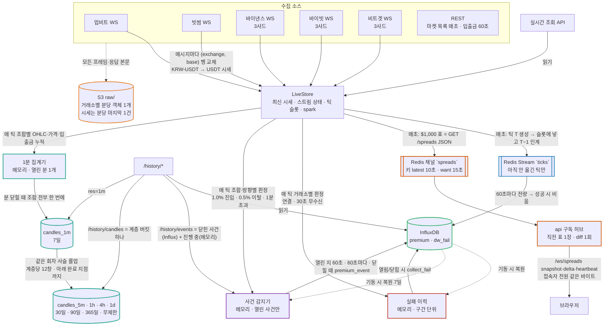

# architecture.md — 구조

> 이 문서는 현재의 핵심 설계 결정과 구현 경계를 쓴다. 기능별 구현 상태는 `status.md` 가 말한다.

## 핵심 설계 결정
- **실시간 시세의 기준은 `live_store`(LiveStore)다.** 실시간 조회 API 는 메모리만 읽고(스프레드 표 푸시는 api 가 Redis 구독으로 — 017), `/history/*` 만 InfluxDB 를 조회한다. HTTP 조회 경로에 S3 호출은 없다. Redis 를 HTTP 가 만지는 곳은 `GET /spreads`(키 `spreads:latest` 읽기·`spreads:want` 쓰기, 018) 하나고 그 밖은 WebSocket 푸시의 구독뿐이다.
- **거래소 시세는 WebSocket 상시 연결로만 받는다.** 업비트·빗썸은 호가·현재가 스트림(001), 바이낸스는 depth20·miniTicker 스트림(012), 바이빗은 orderbook.200 스냅샷+델타·publicTrade 스트림(019), 비트겟은 books15 스냅샷·trade 스트림(020). REST 는 "지금 어떤 코인이 있는가"(마켓·심볼 목록, **매초**)와 입출금 상태(60초)에만 쓴다 — 목록이 바뀐 초에 구독을 더하고 지운다. 다섯 거래소 모두 SSE 는 제공하지 않는다 — 선택지는 WebSocket 뿐이다.
- **저장은 세 계층을 순서대로 흐른다(009).** LiveStore 는 최신 시세와 **최신 틱 1장**을 들고, 새 틱이 만들어지는 순간 직전 틱이 Redis 로 인계된다. Redis 는 Influx 로 아직 옮기지 못한 틱만 들고(원문이 아니라 Influx 가 저장할 모양 그대로), 60초마다 전량이 Influx 로 옮겨진 뒤 비워진다.
- **원문은 S3 에 남긴다(010).** 거래소가 준 WebSocket 프레임·REST 응답 본문을 가공하지 않은 텍스트 그대로 원문 싱크에 넘기고, 거래소별로 **분마다 객체 1개**를 S3 `raw/` 에 쌓는다. 시세 프레임은 심볼·종류마다, 매초 오는 마켓·심볼 목록 응답은 거래소마다 그 분의 마지막 1건만 남기고(용량 — 하루 0.3~0.5GB), 입출금·핸드셰이크 거부 본문 같은 나머지 응답은 전량 남긴다. 쓰는 필드가 바뀌어도 재수집 없이 분 단위로 재생하기 위한 저장소다.
- **시세 커넥터는 공통 인터페이스를 구현하고 코드를 공유하지 않는다.** 거래소별 메시지 형식·quirk 는 각 커넥터 안에서만 흡수한다. 새 거래소 추가는 커넥터 하나 추가다.
- **도메인 계산은 가능한 한 순수 함수로 작성한다.** 네트워크·DB 같은 I/O 의존성은 인자로 주입하고 변경 가능한 전역 상태를 사용하지 않는다. 틱 생성과 표 계산은 `await` 없이 끝난다 — 한 계산 안에서 교체 전후 호가가 섞이지 않는 유일한 근거다.
- **입출금 상태는 `open(true) / closed(false) / unknown(null)` 세 상태를 구분한다.** `unknown` 을 `open` 으로 처리하지 않는다.
- **프로세스 역할은 `ROLE`(collector | api)다(016).** collector 는 uvicorn worker 1개 — `live_store` 가 프로세스 메모리라서, 다중 worker 를 쓰려면 프로세스들이 공유하는 외부 저장소로 먼저 이전해야 한다. api 는 메모리 저장소를 갖지 않고 Influx 만 읽으며(`/history/premium`·`streaks`·`streaks/bulk`·`candles`), Redis 채널 `spreads` 를 구독해 `/ws/spreads` 접속자에게 표를 민다(017). `GET /spreads` 는 두 역할 모두 Redis `spreads:latest` 를 돌려준다(018) — 스프레드 탭이 보는 컨테이너는 api 하나다.

## 런타임 구성
- **server/**: Python 3.12, FastAPI, httpx, websockets, redis(asyncio), influxdb-client, boto3, pyjwt, pydantic v2, pydantic-settings. 로컬 포트 8000. 상시 태스크(collector 역할 — api 는 017 구독 태스크 1개 + 접속마다 보내기 태스크 1개): 업비트·빗썸 스트림 각 1, 바이낸스·바이빗·비트겟 샤드 각 3 + 재조정 루프(60초), 마켓 우주 갱신 루프(매초 — 목록 5개 병렬, 실패는 직전 목록 유지·거래소·원인당 60초 1줄 로그), 틱 루프(1초), Redis 인계 큐, flusher(60초), 원문 닫기 회차(1초, 업로드는 데몬 워커 스레드 1개), 입출금 조회(60초), `collect_fail` 쓰기 큐 태스크, `premium_event` 쓰기 태스크(점이 생기면 즉시·없어도 60초 회차), `candle` 쓰기·롤업 태스크(분이 닫히면 즉시·없어도 60초 회차 — 1m 쓰기 뒤 같은 회차에 5m→1h→4h→1d), 017 표 게시 보내기 태스크·`spreads:want` 읽기(5초)·구독 허브(로컬 단일 프로세스는 자기 게시를 자기 구독).
- **web/**: React 19, TypeScript, Vite. 런타임 의존성은 react·react-dom·lightweight-charts(기록 탭 캔버스 차트) 셋이다. 대시보드는 `/app/` 아래에 산다(Vite `base: '/app/'`) — `/` 는 React 밖의 정적 `public/landing.html` 이 nginx 로 서빙된다(022, 티저 스크립트가 `/api/spreads` 1회 조회). 로컬 포트는 5173 이고, 배포 컨테이너의 nginx 는 80번 포트를 사용한다. 호스트 포트는 `WEB_PORT` 로 정한다.
- **저장소**: InfluxDB 2.7 OSS(org·bucket `marketlens`, Flux) — 김프 이력. Redis 7 — 틱 버퍼(AOF, Influx 로 옮기기 전까지만). S3(`marketlens-spreads-snapshot`, ap-northeast-2, 접두사 `raw/`) — 거래소 원문 아카이브. 모델은 `db.md`. 테스트에서는 셋 다 띄우지 않는다(fake·fakeredis). S3 자격증명은 SDK 기본 탐색(로컬 `~/.aws`, EC2 IAM 역할). 배포에서 Redis·Influx 는 data 박스에 있고 server·api 가 사설 IP(루트 `.env` 의 `DATA_HOST`)로 붙는다(021).

## 데이터 흐름 (BE)

- 테두리 색 = 스펙 번호: 주황 010(원문 싱크) · 파랑 009(틱 저장) · 초록 005(history) · 빨강 011(health) · 보라 013(premium-events) · 청록 014(premium-1m) · 갈색 017(spreads-push). 점선은 부수 흐름.
- 행은 거래소 단위 통째 교체가 아니라 **메시지 단위**로 바뀐다. 상장·상폐는 매초 갱신되는 **마켓 우주**(국내 KRW ∩ (바이낸스 ∪ 바이빗 ∪ 비트겟) USDT)가 반영한다 — 우주 밖 행은 없다.
- 스트림이 끊기면 행은 남고 그 거래소의 `last_message_at` 이 멈춘다. `/spreads` 의 `age`·`status` 는 행이 아니라 **거래소 스트림의 마지막 수신 시각** 기준이다(조용한 코인의 호가는 안 바뀌어도 현재값이다). 단 행 자체(`updated_at`)가 **300초** 이상 안 바뀌면 `age` 는 그 행의 실제 경과 초라 stale 로 보인다(거래 정지·심볼 장애 — 스트림은 살아 있는데 그 코인 프레임만 안 오는 상태).
- 입출금 상태 API 는 틱 루프가 60초 주기로만 조회해 캐시하고, 행이 새 메시지로 교체돼도 그 3필드는 물려받는다. 키가 없으면 `null`(모름). 망 판정은 core 공용 함수 하나로 `/spreads` 행과 틱이 같이 한다(024) — 틱의 입출금 4상태는 006 판정값이고 망 이름 2개(국내·해외 표시명)를 함께 싣는다. 빗썸은 키가 필요 없다.
- `GET /health` 와 틱 루프는 기능 폴더가 아니라 앱 진입점 소관이다. `/health` 는 프로세스 liveness 만 나타낸다. 상세는 `/health/collect`(011).
- USDT 시세는 별도 호출 없이 국내 거래소의 `KRW-USDT` 호가 메시지에서 추출한다. 최우선 매도호가가 rate_ask(USDT 살 때), 최우선 매수호가가 rate_bid. 거래소별 ask/bid. 은행 환율은 어디에도 쓰지 않는다(product.md 용어).
- `POST /refresh` 는 시세를 묻지 않는다 — 마켓 우주 갱신·재구독·입출금 재조회를 즉시 시키는 진단용 트리거다.
- 재기동 시 시세는 스트림 스냅샷으로 수 초 안에 복구되고, 이력 24시간(011)과 spark 30분(009)은 Influx 에서 되읽는다. Redis 에 남아 있던 틱은 다음 flusher 회차에 옮겨진다.

## 데이터 흐름 (FE)
- 스프레드 표는 WebSocket `/ws/spreads` 연결 1개(017), 나머지는 `fetch` 폴링. 상태관리·라우터·스타일 라이브러리 없음.
- API base: `VITE_API_BASE` (미설정 시 `/api`). dev 는 vite proxy `/api → http://localhost:8000` (prefix strip), 배포는 nginx `/api/ → server:8000/`.
- 폴링 실패 시 직전 데이터 유지.
- 셸의 공유 피드가 탭 공통 데이터를 들고, 1.5초 tick 은 셸이 돌린다. `/ws/spreads` 구독(snapshot 통째 교체·delta 키 병합, 10초 무응답 재연결·백오프, 폴링 fallback 없음)은 spreads 기능(017)이, `/health/collect` 5초 폴링은 health 기능(011)이 제공한다. 기록 탭은 `/history/events` 60초 재조회(013)와 `/history/candles` 청크 캐시(014 — 봉 종류 → 계층, 쌍마다 360창 청크, 최신 청크만 60초 재조회, 계층 안 접기)를 쓴다.

## 계약 규칙 (BE ↔ FE)
- BE 내부는 snake_case 를 사용한다. HTTP JSON 키와 복합어 쿼리 파라미터는 모든 엔드포인트에서 camelCase 를 사용한다. 정확한 스키마는 각 기능의 모델과 타입이 정의한다.
- `/spreads` 최상위 `warnings: list[str]` — USDT 시세 60초 미갱신 경고. 없으면 빈 배열(키는 항상 존재). (스펙 008)
- 응답 압축: GZip 미들웨어를 앱 전역에 켠다 — `/history/streaks/bulk` 같은 수 MB JSON 때문. 설정은 001 의 앱 골격 소관.
- FE 가 소비하는 응답 스키마를 변경할 때는 같은 변경에서 BE 모델과 FE 타입을 함께 수정한다.
- 비즈니스 에러는 `{"error": {"code": str, "message": str, "detail": any}}` 형식이다. 인증 실패와 FastAPI 요청 검증 실패(422)는 `{"detail": ...}` 형식을 사용한다. 처리 안 된 예외도 같은 형식의 500(`internal_error`, 내용 없음)이다(025).
- `/health` 의 503 은 상태 응답(`{"status","version","lastTickAt"}`)이라 `{"error":…}` 형식이 아니다 — uptime 서비스가 상태코드만 보고 판정한다(025).

## core 가 제공하는 계약 (기능·스펙이 공유하는 Protocol)
- 원문 싱크 `record(exchange, source, received_at_ms, payload, key=None)` — 동기·무예외(010 구현, 수신 경로가 호출). `key` 는 시세 프레임이면 `"<종류>:<원본 심볼>"`(`orderbook:KRW-BTC`·`depth20:BTCUSDT`), 매초 오는 마켓 목록 응답은 `markets:all`(업비트·빗썸)·`symbols:all`(바이낸스), 그 밖(입출금 REST 본문·핸드셰이크 거부·비시세 프레임·디코드 실패)은 None — 010 이 `key` 있는 줄을 분당 마지막 1건으로 솎는 데 쓴다.
- 틱 인계 `handoff(tick)` — 동기·무예외(009 구현, 틱 루프가 호출).
- 판정 결과 전달 — 틱 루프가 이력 추적기에 거래소별 성공/실패를 넘긴다(011 구현).
- 사건 감지 `observe(tick)` — 틱 루프가 매초 현재 틱을 넘긴다(013 구현, 동기·예외 없음).
- 입출금 조회기 `refresh_if_due(client, force=False)` / `apply` / `failed` / `warnings` / `availability`(006 구현, 틱 루프가 호출 — `force` 는 `/refresh` 트리거가 쓴다).
- 해외 USDT 현물 심볼 집합 `id` / `refresh(client) -> int` / `bases() -> set[str]` / `set_universe(bases)`(012·019·020 커넥터가 각각 구현, 마켓 우주가 **목록**으로 받아 합집합을 만들고 확정될 때마다 각 커넥터에 `set_universe` 로 우주 전체를 넘긴다 — 자기 맵에 없는 base 는 커넥터가 무시한다). 커넥터를 꽂지 않는 테스트에는 빈 집합을 주는 기본 구현.
- 스트림 판정 `judge(now_ms) -> Verdict | None`(거래소 스트림마다 — 국내는 core 공통 규칙, 바이낸스·바이빗·비트겟은 샤드 규칙(012·019·020). None = 아직 판정 대상 아님).
core 는 features 를 import 하지 않는다 — 구조적 타입(Protocol)으로만 알고 배선은 `main.py` lifespan 이 한다.

## 기능 폴더 기본 구조
기능에 필요한 파일만 둔다. BE 전용 기능은 web 폴더가 없고, API 를 호출하지 않는 mock 화면은 `api.ts`·`types.ts` 가 없어도 된다.

```
server/app/features/<name>/
  router.py     HTTP API가 있으면 APIRouter를 선언한다.
  service.py    기능 흐름을 조립한다. 계산은 가능한 한 순수 함수로 두고 I/O 의존성은 인자로 받는다.
  models.py     요청·응답 모델이 있으면 둔다.
  tests/        기능 테스트. 외부 네트워크는 fake로 대체한다.
web/src/features/<name>/
  Tab.tsx       해당 기능의 화면.
  api.ts        실제 API를 호출할 때 fetch 함수와 표시 전용 가공을 둔다.
  types.ts      실제 API 응답을 사용할 때 BE 응답과 맞는 타입을 둔다.
```

## 배포 토폴로지
EC2 3대(021), 같은 VPC·서브넷, 박스끼리는 사설 IP 로만 통신한다. compose 파일은 하나이고 서비스 5개(server=collector·api·web·influxdb·redis)에 profile 이 하나씩 있어 박스마다 자기 profile 만 띄운다: `docker compose --profile <collect|data|serve> --env-file .env --env-file server/.env up -d --build`. `depends_on` 은 없다(의존 대상이 다른 박스).
- **collect**(c7g.medium) — `server`. 거래소 WebSocket·틱 루프·Redis 인계·flusher·S3 원문·입출금 조회. 호스트 8000(serve 보안그룹만), 탄력 IP(업비트 허용 IP), IAM 프로파일은 이 박스에만.
- **data**(t4g.small, 스왑 1GB) — `redis`·`influxdb`. 호스트 6379·8086(collect·serve 보안그룹만). Influx 쿼리 메모리 상한 1개 256MB × 동시 3 = 768MB.
- **serve**(t4g.micro, 공개 주소 `https://kimptrack.com`) — `api`·`web`·`caddy`. 호스트 80(`WEB_PORT`)·443 은 caddy 가 쥔다(023) — `kimptrack.com`·`www` 는 Let's Encrypt 로 TLS 종단, 그 밖의 호스트(탄력 IP `3.34.104.16` 직접)는 평문 — 둘 다 web(nginx :80) 으로 넘긴다. nginx 가 `/api/` 를 `COLLECT_HOST:8000` 으로 프록시하고 `/api/history/{premium,streaks,candles}`·`/api/ws/`(WebSocket 업그레이드)·`/api/spreads`(정확 일치) 는 같은 박스의 api 로 보낸다.
박스 간 주소는 루트 `.env` 의 `DATA_HOST`·`COLLECT_HOST` 두 키다. 기본값이 서비스 이름이라 로컬은 `COMPOSE_PROFILES=collect,data,serve` 로 예전처럼 5개가 한 망에 뜬다. PR CI 는 server lint·format·pytest 와 web lint·build 를 실행한다. main push 는 워크플로가 data → collect → serve 순서로 SSH 배포한다(한 박스가 실패하면 뒤는 돌지 않는다). 상세는 스펙 007(deploy)·021(infra-split), 전환 절차는 `docs/runbooks/ec2-split.md`.
다섯 컨테이너 모두 compose 가 로그를 `json-file` 50MB × 3 으로 묶는다 — 회전 없는 로그가 디스크를 채우면 Influx 가 쓰기를 거부하고, 그 거부는 공간을 되찾아도 재시작 전까지 풀리지 않는다.
배포 workflow 의 성공은 EC2 명령 실행 성공만 뜻한다. 외부 URL 확인과 실패 시 자동 롤백은 아직 없다.

## 현재 구조 (개발 후 갱신 — 실행 세션이 §7 보고와 함께 채운다)
스펙이 DONE 될 때마다 주요 모듈과 역할을 짧게 기록한다. 문서와 코드가 다르면 사람이 올바른 쪽을 결정하고 같은 변경에서 둘을 맞춘다.
- **collect (001)**: `core/models.py`(`Row`·`Rate`·`StreamState`·`StreamError`·`Tick`·`TickRow`), `core/live_store.py`(행 단위 쓰기 `put_row`·`remove_row`·`retain_bases`, 입출금 3필드 물려받기, 스트림 상태 `stream`/`stream_state`, 틱 슬롯 `push_tick`, spark 맵), `core/rows.py`(`clean_levels` — 잔량 필터·누적 상한), `core/quotes.py`(`QuoteSink` — 메시지 → 행 규칙·우주 필터·체결가 보류·USDT 시세), `core/streams/upbit.py`·`core/streams/bithumb.py`(스트림 커넥터 2개 — 연결·구독·펌프·분류·백오프·재구독·`fetch_markets`·`judge`; 코드 공유 없음), `core/universe.py`(`UniverseRefresher` — 매초 회차·네 목록 병렬·실패한 거래소는 직전 목록 유지·`(거래소, 원인)` 당 60초 로그 억제·해외 합집합과의 교집합·구독 목록 배포), `core/ticks.py`(`judge_state`·`build_tick`·`TickLoop`), `core/collect.py`(`CollectService.refresh_now` — `/refresh` 트리거·`RefreshSummary`), `core/contracts.py`(원문 싱크·틱 인계·판정·입출금·해외 심볼 Protocol 과 무동작 기본 구현), `core/config.py`(`EXCHANGES`·타임아웃), `core/errors.py`(`ExchangeError`·`FAIL_KINDS` — REST 실패 예외와 실패 종류 8종), `core/serialization.py`(`camelize_json` — 모든 라우터의 HTTP 경계 camelCase). `main.py` lifespan: Influx·Redis 연결 확인 → 이력 복원 → spark 복원 → 우주 → 스트림 → 틱 루프 → 인계 보내기·flusher, 종료 시 마지막 틱 인계·큐 비우기. 테스트는 `server/tests/`(`stream_fakes.py` 의 가짜 소켓·연결기).
- **web-shell (002)**: `shared/`(테마·공유 피드·결정론 mock·포맷·UI 조각·`urlState`= URL 쿼리에 실리는 화면 상태 훅), `App.tsx`(헤더·KPI·탭 전환), `features/{gap,pp,flow}/Tab.tsx`(mock 탭). spreads 와 history 는 별도 기능 폴더가 담당한다.
- **spreads (003)**: server `core/premium.py`(`premium_percent`), `core/orderbook.py`(호가 걷기 — 004 와 공용, 전부 동기), `features/spreads/`(service 순수 계산·router — `GET /spreads` 는 Redis 읽기(018), `POST /refresh` 는 별도 라우터·models). 표 계산 함수(`build_table` — 뜨거운 경로는 dict, `build_spreads` 는 같은 표를 `SpreadsResponse` 모델로 — 테스트용; 두 경로가 같은 바이트인지 테스트가 지킨다)는 저장소와 체결 규모(`notional`, 기본 $1,000 — 017 게시기는 이 값 고정, HTTP 로는 다른 규모를 받지 않는다)를 받아 행 17키를 만들고, 두 다리를 수량으로 연결해 걸어 슬리피지 차감 후 순값과 차감폭(`slipFwd`·`slipRev`)을 함께 싣는다. web `features/spreads/`(017 구독 훅·응답 타입·화면). `age` 는 양측 거래소 스트림의 `last_message_at` 기준이되 행 `updated_at` 이 300초 이상이면 그 행의 경과 초(`ROW_STALE_SEC`)이고, `/refresh` 는 001 의 `RefreshSummary` 를 노출한다.
- **analysis (004)**: `core/orderbook.py`(호가창 소진 순수 계산 — `walk_amount`·`walk_quantity`·`average_price`·`slippage_percent`·`walk_levels`, 003 과 공용, 전부 동기), `features/analysis/` — `service.py`(6개 빌더·거래소 레지스트리·`AnalysisApiError`)·`router.py`(루트 경로 6개, 오류를 `{"error":…}` 로 변환)·`models.py`(응답 모델, snake_case → 라우터에서 camelCase). 모든 응답은 LiveStore 만 읽고 걷기는 행의 `asks`/`bids` 그대로다. web 없음. 테스트는 `features/analysis/tests/`(표준 시드 `helpers.py`).
- **history (005)**: `core/influx.py`(`InfluxClient` — influxdb-client 를 import 하는 유일한 곳, lazy 연결·`ping`·`write`·`premium` 조회 3종 + 009 `query_spark`·011 `collect_fail`, 점 생성 `premium_point`·`dw_fail_point`·`collect_fail_point` 와 line protocol 직렬화, 실패는 전부 `InfluxUnavailableError`), `features/history/`(`service.py` 순수 계산 — 주/월 경계·컴팩트 events·streak 구간·샘플 가중 요약·bulk 집계, 리더는 `query_premium` Protocol 로 주입 / `router.py` 3 엔드포인트 — 검증 422·업무 오류 400/404·저장소 503, 동기 클라이언트는 스레드에서 / `models.py`), `scripts/backfill.py`(순수 계산과 거래소 호출 분리, UTC 하루 단위·앞뒤 빈 구간만), 루트 `docker-compose.dev.yml`(Influx 2.7 + Redis 7). `main.py` 는 `INFLUX_TOKEN` 이 있을 때만 클라이언트를 만들어 `app.state.influx` 에 두고 ping 실패는 에러 1줄. web `features/history/Tab.tsx` 는 002 의 mock 사건을 그린다. Influx 쓰기는 009 의 flusher 가 한다. 테스트는 `features/history/tests/`(fake 리더)·`server/tests/test_backfill.py`(순수 계산).
- **wallet-status (006)**: `core/networks.py`(`Network` 모델, `normalize_name` 정규화·`match_network` 판정·`pick_domestic` tie-break·동일 체인 표, `wallet_fields` 5필드+해외 망 판정 — spreads 행·틱 공용(024)), `features/wallet_status/`(`upbit.py` JWT HS256·`binance.py` HMAC-SHA256(쿼리 서명)·`bybit.py` HMAC-SHA256(헤더 서명)·`bithumb.py` public 조회기 4개 — 코드 공유 없음, 각각 응답을 받는 즉시 010 `record` 로 본문을 남긴다 / `service.py` `WalletStatusService` — `WalletStatusProvider` 계약 구현: 60초 캐시·4거래소 병렬 조회·실패 거래소 `unknown` 덮기·경고·`failed` / `models.py` `CoinStatus`·`WalletStatusError`). `main.py` 가 키 6개와 원문 기록 함수를 주입해 틱 루프(별도 태스크로 조회, `apply` 로 행에 반영)와 `/refresh` 트리거(`force`)에 꽂고, spreads 의 행 계산은 `wallet_fields` 의 앞 다섯 값으로 행 5필드를 만든다(`net_fx` 는 싣지 않는다). 테스트는 `features/wallet_status/tests/`(MockTransport·`FakeRecorder`)·`server/tests/test_networks.py`·`test_wallet_integration.py`.
- **deploy (007)**: `server/Dockerfile`(python 3.12 slim, `pip install .`, `COPY` 는 pyproject·app·scripts 만 — `.dockerignore` 가 `.env` 를 컨텍스트에서 뺀다, uvicorn 워커 1개), `web/Dockerfile`(node 22 빌드 → nginx 1.27 정적 서빙)·`web/nginx.conf`(`/api/` → `server:8000/` 접두 제거, `/` 는 `landing.html`·쿼리 있으면 `/app/` 301, `/app/` 은 alias 로 dist 를 주고 SPA fallback 은 `/app/index.html`, 루트의 없는 경로 404, `index.html`·`landing.html` no-store·`assets/` immutable — 022), 루트 `docker-compose.yml`(name `marketlens`, 컨테이너 5개 `marketlens-*`, web 만 `${WEB_PORT:-80}:80`, server 는 `env_file: server/.env` + `INFLUX_URL`·`REDIS_URL` 서비스명 덮어쓰기, named volume 2개), `.github/workflows/ci.yml`(PR → `server`·`web` job, 경로 필터 없음)·`deploy.yml`(main push → SSH → `server/.env`·`INFLUX_TOKEN`·`S3_BUCKET` 가드 → `git reset --hard origin/main` → `compose --env-file .env --env-file server/.env up -d --build` → `image prune`), PR 템플릿 3줄, README. 설정 계약은 `server/tests/test_deploy.py` 가 파일을 읽어 단언한다(Docker 없는 CI 에서 도는 회귀 장치).
- **process-split (016)**: `core/config.py` 의 `role`(Literal, 기본 collector — 허용값 밖이면 `Settings()` 가 실패한다), `main.py` 의 `_api_lifespan`(Influx 생성·ping 만) 과 역할별 라우터 include(api 는 `/health` + history `router` 만, `events_router` 제외). `features/history/router.py` 는 `router`(Influx 4경로)·`events_router`(`/history/events`) 둘. compose `api` 서비스(같은 빌드, `ROLE=api`), `web/nginx.conf` 의 정규식 location(`^/api/history/(premium|streaks|candles)` → `api:8000`, rewrite 로 접두 제거). 계약은 `tests/test_role.py`(역할)·`tests/test_deploy.py`(compose·nginx).
- **tick-store (009)**: `core/redis_stream.py`(`RedisTickStream` — redis 를 import 하는 유일한 곳. `ticks` XADD/XRANGE 페이지/XDEL, 재시도 없음, 연결 2초·명령 5초), `core/tick_store.py`(`encode_tick`/`decode_tick` gzip JSON, `TickRelay` — `handoff` 구현: spark 갱신·게시 → 600 큐 → 보내기 태스크가 순서대로 XADD, 실패 틱은 버림, 종료 시 큐 비우기 총 5초 상한; `Flusher` — 60초마다 1,000건 페이지 단위로 읽기 → 스레드에서 5,000점 배치 쓰기 → 그 페이지만 XDEL → 다음 페이지, 연속 실패 수·잘림 감지(지우지 못한 첫 ID 기준, XDEL 실패는 제외)), `core/spark.py`(`SparkBuffer` 1분 버킷 last 30개 링버퍼, `restore_spark` 기동 복원 10초 상한), `core/influx.py` 의 `query_spark`(aggregateWindow 1m last). `INFLUX_TOKEN` 없으면 flusher 를 띄우지 않는다. 테스트는 `server/tests/test_tick_store.py`·`test_spark.py`·`test_tick_store_history.py`(fakeredis + `tests/conftest.py` 의 `FakeInflux`).
- **raw-archive (010)**: `core/s3.py`(`S3Uploader` — boto3 를 import 하는 유일한 곳, `put`·`head_bucket`, 로그 없음), `core/raw_archive.py`(`format_line`·`object_key`·`pack` 순수 함수, `RawArchive` — 001 의 `record(…, key)` 계약 구현: `(거래소, UTC 분 창)` 버퍼에 줄을 붙이고 `key` 있는 줄은 `(source, key)` 당 마지막 1건만, 매초 닫기 회차가 지난 창을 닫아 스레드에서 gzip → 거래소 합산 단일 FIFO 대기열 → 데몬 워커 스레드 1개가 순서대로 `PutObject`(실패는 머리에 두고 1초 뒤 재시도, 압축 후 256MB 초과 시 오래된 객체부터 버림), 종료 5초 상한). 수신 경로와 분리한 이유 — 기록 함수는 메모리 붙이기뿐이라 어떤 S3 장애도 스트림·틱 루프를 한 줄도 막지 않는다. `main.py` 가 `S3_BUCKET` 이 있을 때만 만들어 스트림 3개와 006 조회기에 `record` 를 주입하고, 없으면 `noop_record`. 테스트는 `server/tests/test_raw_archive.py`(fake S3·주입 시계).
- **health (011)**: `core/outages.py`(실패 구간 추적기 — 틱 루프가 쓰므로 core. 열림/닫힘 시 `collect_fail` 1점을 순서 보장 큐로 쓰고, 기동 시 24시간 복원), `features/health/`(읽기 API `/health/collect`), web `features/health/`(5초 폴링·탭). 응답 타입 `HealthData` 와 거래소 표시명 `exName` 은 `shared/` 에 있다.
- **premium-events (013)**: `core/premium_events.py`(`PremiumEventDetector` — 틱 루프가 쓰므로 core. 조합·방향별 열린 사건만 메모리, 열린 지 60초·60초마다·닫힐 때 `premium_event` 1점을 미전송 맵(같은 키 덮어쓰기, 상한 1,000)에 모아 쓰기 태스크가 한 번에 쓰고 실패 뒤 60초는 재시도 안 함, 기동 시 7일 복원 3초 상한), `core/influx.py` 의 `PremiumEventRow`·`premium_event_point`·`query_premium_events`, `core/contracts.py` 의 `EventSink`. 읽기 API 는 `features/history/`(`build_events` — Influx 닫힌 사건 + 메모리 진행 중, 고아 점은 last_ts 로 닫힌 것처럼) `GET /history/events`. web `features/history/`(`api.ts` 60초 재조회·`stats.ts` 순수 집계·`Tab.tsx` 김프/역프 서브탭). 테스트는 `server/tests/test_premium_events*.py`(`premium_event_fakes.py`)·`features/history/tests/test_events_api.py`.
- **premium-1m (014)**: `core/candles.py`(틱 루프·쓰기 태스크가 쓰므로 core — `TIERS`·`window_start`(KST 정렬)·`limit_sec`, `CandleAggregator` — 013 감지기 다음 자리의 `observe`: 열린 분 1개의 조합별 누적 → 분 닫힐 때 `candle_point` 를 미전송 맵(상한 10,000)에 → `run_writer_loop` 회차가 `candles_1m` 에 한 번에 쓰고 이어 `Rollup.run_round`(5m→1h→4h→1d, 계층당 12창, 접는 창의 끝 ≤ min(지금, 아래 계층 완료 지점 — 1m 은 열린 분의 시작)), 실패 뒤 60초 재시도 없음; `Rollup.restore` 기동 기준점(위 버킷 마지막 점 → 아래 계층들 가장 오래된 점 → 지금 창, 계층당 3초 상한); `ensure_candle_buckets` 3초 상한), `core/influx.py` 의 `CandleRow`·`candle_point`·`write(points, bucket)`·`list_buckets`·`create_bucket`·`query_candles`·`latest_candle_ts`·`earliest_candle_ts`(시리즈별 first/last 푸시다운, 보관 기간 안에서만), `core/models.py` `TickRow` 의 9개 추가 필드(가격 3·판정 4상태·망 이름 2, 기본값 — Redis 되읽기·`premium` 은 그대로). 읽기 API 는 `features/history/`(`build_candles` — 계층 버킷 하나·1,440창 상한·방향별 필드·경로 두 끝·3상태 → null) `GET /history/candles`. web `features/history/`(`candles.ts` 순수 — 봉→계층·청크 계산·보관 상한·띠 색 규칙, `api.ts` `useCandles` 청크 캐시·디바운스·취소·최신 청크 60초, `rollup.ts` KST 고정 정렬·`samples` 합, `Chart.tsx` 상태·경로 라벨·모름 회색). 테스트는 `server/tests/test_candles.py`(`candle_fakes.py`)·`features/history/tests/test_candles_api.py`.
- **spreads-push (017)**: `core/redis_bus.py`(`RedisBus` — redis 를 import 하는 두 번째 모듈, 채널 `spreads`·키 `spreads:latest`·`spreads:want` 의 publish/set/get/subscribe, `Subscription.get(timeout)` 은 제어 메시지를 건너뜀), `features/spreads/push.py`(`SpreadsPublisher` — 틱 루프의 `spreads` 자리(013·014 다음)에서 `observe(tick)`: 메모리의 원함 값이 참일 때만 `build_table`(응답 모양의 camelCase dict — 모델을 거치지 않는다, 사는 쪽 걷기는 마켓별 메모) → `encode_table` JSON → 큐 2장 → 보내기 태스크가 PUBLISH+SET, want 읽기 태스크 5초, 같은 원인 경고 60초 1줄, 표 생성 300ms 초과 경고), `features/spreads/hub.py`(순수 `make_snapshot`·`make_delta`(키 `sym|dom|fx`, `age` 제외 비교, `removed`), `Connection` — 접속당 대기열 5·보내기 태스크·1초 heartbeat·가득 차면 1008, `SpreadsHub` — 접속자 있을 때만 직전 표·인덱스, 첫 접속자는 `spreads:latest`→snapshot 아니면 waiting + want 즉시 1회, 구독 태스크 하나가 채널 수신과 5초 want 갱신을 맡고 끊기면 1→30초 백오프, 종료 시 전원 1001), `features/spreads/ws.py`(`/ws/spreads` — 두 역할 모두 포함, 클라이언트 메시지 무시). `main.py` 가 두 lifespan 에서 `RedisBus`·허브를 만들고 collector 는 게시기도 띄운다. web `features/spreads/api.ts`(`useSpreadSocket` — origin 기준 ws(s) URL, 서버 키 → 행 객체 Map 으로 delta 병합·안 바뀐 행은 같은 객체 유지, 무응답 감지·백오프 상수는 `shared/config.ts`, 폴링 fallback 없음(018 에서 삭제)). compose `api` 에 `REDIS_URL`·`depends_on: redis`, nginx `location /api/ws/`, vite `ws: true`. 테스트는 `features/spreads/tests/test_push.py`(fakeredis 공유 서버·FakeWs)·`test_ws.py`(TestClient WebSocket + lifespan 안 허브)·`tests/test_role.py`·`test_deploy.py`.
- **spreads-serve (018)**: `features/spreads/router.py` 의 `router`(`GET /spreads` — 두 역할 모두 `main.py` 가 포함, `app.state.spreads_bus` 의 `RedisBus.latest_and_want()` 로 `GET spreads:latest` + `SET spreads:want EX 15` 를 파이프라인 한 왕복, 키 값을 `Response` 바이트 그대로·없으면 404·`RedisUnavailableError` 면 503·`notional` 쿼리는 400)와 `refresh_router`(`POST /refresh` — collector 만). `core/redis_bus.py` 의 `RedisUnavailableError`(redis 예외를 HTTP 경계로 넘기는 유일한 이름). `web/nginx.conf` 의 `location = /api/spreads`(정확 일치 → `api:8000`, rewrite 로 접두 제거). 테스트는 `features/spreads/tests/test_spreads_api.py`(HTTP 계약은 fakeredis, 표 계산 규칙은 헬퍼 `spreads_json` — 게시기와 같은 함수·직렬화)·`test_push.py`(게시 안 하는 조건)·`tests/test_role.py`·`test_deploy.py`.
- **binance-stream (012)**: `core/streams/binance.py`(`BinanceStream` 하나 — 샤드 3개 각각 소켓·시계·백오프·구독 집합, `shard_of` = crc32 % 3, 재조정 루프 1개(배정이 바뀐 `set_universe` 가 깨우거나 60초 — 매초 같은 우주는 무동작), exchangeInfo 심볼 맵으로 `ForeignSymbolSource` 구현, `judge` 는 샤드별 판정 후 가장 조용한 샤드를 고른다). 001 의 `QuoteSink.orderbook/trade` 와 `store.stream("binance")`(샤드 집계) 를 쓰고 `StreamJudge` 로 틱 루프·`/refresh` 트리거에 꽂힌다. 테스트는 `server/tests/test_stream_binance.py`(001 의 `stream_fakes.py` 재사용).
- **bybit (019)**: `core/streams/bybit.py`(`BybitStream` 하나 — 012 와 같은 샤드 3개·`shard_of`·재조정 루프 구조를 코드 공유 없이 다시 쓴다. 다른 점: 심볼마다 로컬 북 `_Book`(스냅샷 교체·델타 삽입/교체/삭제, 소켓이 바뀌면 비움)에서 매 메시지 행을 다시 만들고, 샤드마다 JSON ping 태스크(20초 ping·20초 안에 pong 없으면 소켓을 닫아 `timeout` 으로 재연결), 구독 요청은 args 10개·0.1초 간격, instruments-info(`retCode`≠0 은 실패) 로 `ForeignSymbolSource` 구현). `features/wallet_status/bybit.py`(`fetch_bybit` — 헤더 HMAC, `chains[]` → 망). 배선: `main.py` 가 `UniverseRefresher(foreigns=[binance, bybit])` 와 `streams` 4개, `WalletStatusService` 바이빗 키. `/history/*` 의 `fx` 는 `Literal["binance", "bybit"]`. 테스트는 `server/tests/test_stream_bybit.py`(`BybitSleeps` — 핑 주기를 표로 막는다)·`features/wallet_status/tests/test_bybit.py`.
- **bitget (020)**: `core/streams/bitget.py`(`BitgetStream` 하나 — 012·019 와 같은 샤드 3개·`shard_of`·재조정 루프 구조를 코드 공유 없이 다시 쓴다. 다른 점: 심볼마다 로컬 북 `_Book` 이 마지막 `seq` 를 들고 역행 update 를 버리며, 샤드마다 문자열 ping 태스크(30초 `ping`·30초 안에 `pong` 없으면 소켓을 닫아 `timeout` 으로 재연결), 구독 요청은 `{instType, channel, instId}` 객체 args 50개·0.2초 간격, 소켓마다 1시간 창의 요청 시각 deque 로 예산을 세어 192회부터 경고 1줄(소진 중 한 번)·재조정 연기, symbols(`code != "00000"` 은 실패) 로 `ForeignSymbolSource` 구현, base 별 마지막 체결 ts 로 과거 체결 무시). `features/wallet_status/bitget.py`(`fetch_bitget` — 인증 없음, `chains[]` 의 문자열 `"true"` → 망). 배선: `main.py` 가 `UniverseRefresher(foreigns=[binance, bybit, bitget])` 와 `streams` 5개, `WalletStatusService` 가 조회기 5종. `/history/*` 의 `fx` 는 `Literal["binance", "bybit", "bitget"]`. 테스트는 `server/tests/test_stream_bitget.py`(`BitgetSleeps` — 핑·백오프 상한이 둘 다 30초라 표로 막는 값을 테스트가 고른다)·`features/wallet_status/tests/test_bitget.py`.
- **slack-alerts (025)**: `core/notify.py`(`Notifier` — 웹훅 URL 하나·`notify(key, text)` 동기 즉시 반환·키별 600초 억제·큐 100·보내기 태스크 1개(`notify_sender`)·전송 실패는 버리고 `marketlens.notify` WARNING 10분 1줄; `SlackLogHandler` — 루트 로거의 ERROR 이상·`marketlens.*` 만·자기 로거 제외·키는 포맷 전 템플릿), `core/heartbeat.py`(`HeartbeatSink` — 틱 루프 맨 끝 자리의 `observe`: `RedisBus.set_heartbeat` 로 `collect:heartbeat` EX 30, 직전 쓰기가 안 끝났으면 건너뜀), `core/outages.py`(`OutageTracker(alerts=)` — 구간 60초 도달 틱에 발생 1회·그 구간이 닫힐 때 복구 1회, `Outage.notified`), `main.py`(`_install_notifier` — URL 없으면 아무것도 안 만듦, 두 lifespan 이 시작·종료·기동 알림, 일반 `Exception` 핸들러, `/health` 는 collector 가 `LiveStore.received_at`·api 가 `RedisBus.heartbeat()` 로 ok/starting/stale/redis_down). 라이브러리 추가 없음. 외부 uptime 은 `docs/runbooks/uptime-monitor.md`. 테스트는 `tests/test_notify.py`·`test_heartbeat.py`·`test_outages.py`(알림 절)·`test_health.py`.
