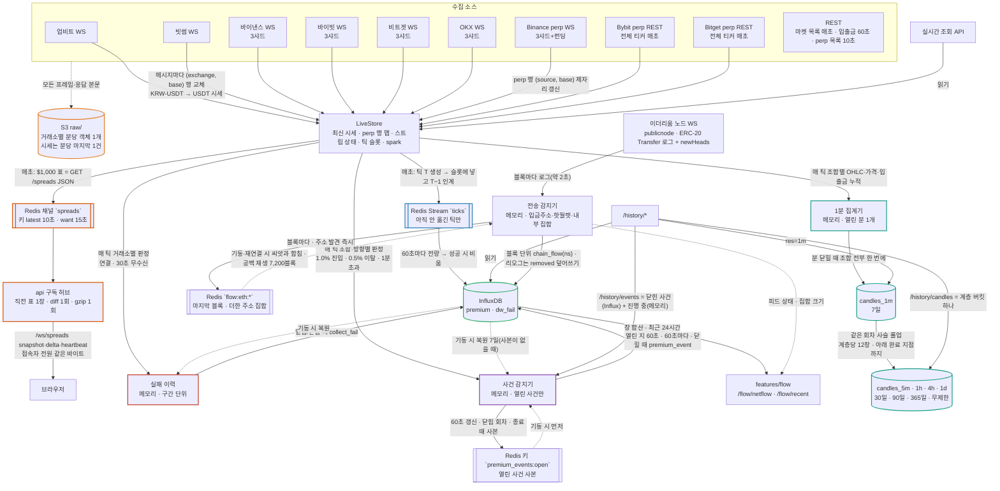

# architecture.md — 구조

> 이 문서는 현재의 핵심 설계 결정과 구현 경계를 쓴다. 기능별 구현 상태는 `status.md` 가 말한다.

## 핵심 설계 결정
- **실시간 시세의 기준은 `live_store`(LiveStore)다.** 실시간 조회 API 는 메모리만 읽고(스프레드 표 푸시는 api 가 Redis 구독으로 — 017), `/history/*` 와 랜딩 요약 `/landing`(022 — 1분 봉 1시간·사건 7일) 만 InfluxDB 를 조회한다. HTTP 조회 경로에 S3 호출은 없다. Redis 를 HTTP 가 만지는 곳은 `GET /spreads`(키 `spreads:latest` 읽기·`spreads:want` 쓰기, 018)와 `GET /landing`(`spreads:latest` 읽기만, 022) 둘이고(029 의 관리자 상태 `GET /admin/status` 는 Redis·Influx 에 ping 만, 034 의 `/admin/alerts` 는 `alerts:log` 읽기, 035·040 의 `/admin/clarity` 는 `admin:clarity`·`admin:clarity:pages` 읽기·쓰기, 052 의 `/admin/attention` 은 `attn:d:*` 읽기 — 052 의 `POST /attention` 은 Redis 를 부르지 않고 api 메모리에 더한다) 그 밖은 WebSocket 푸시의 구독뿐이다.
- **거래소 시세는 WebSocket 상시 연결로만 받는다.** 업비트·빗썸은 호가·현재가 스트림(001), 바이낸스는 depth20·miniTicker 스트림(012), 바이빗은 orderbook.200 스냅샷+델타·publicTrade 스트림(019), 비트겟은 books15 스냅샷·trade 스트림(020), OKX 는 books5 스냅샷·trades 스트림(045). perp 는 바이낸스 depth5@500ms(`/public`)+!markPrice@arr@1s(`/market`) 스트림(046)이고, **바이빗·비트겟 perp 만 예외로 REST 전체 티커를 매초 1회 받는다**(046 — 심볼별 WebSocket 티커가 초당 약 8,400 프레임이라 수집기 CPU 를 두 배로 만들었고, 갭 표는 1초 틱이라 1초 지연이 손해가 아니다, 2026-10-08 결정). REST 는 그 밖에 "지금 어떤 코인이 있는가"(마켓·심볼 목록, **매초**)와 입출금 상태(60초), perp 목록·펀딩 주기(10초·60초)에 쓴다 — 목록이 바뀐 초에 구독을 더하고 지운다. 여섯 거래소 모두 SSE 는 제공하지 않는다 — 선택지는 WebSocket 뿐이다.
- **저장은 세 계층을 순서대로 흐른다(009).** LiveStore 는 최신 시세와 **최신 틱 1장**을 들고, 새 틱이 만들어지는 순간 직전 틱이 Redis 로 인계된다. Redis 는 Influx 로 아직 옮기지 못한 틱만 들고(원문이 아니라 Influx 가 저장할 모양 그대로), 60초마다 전량이 Influx 로 옮겨진 뒤 비워진다.
- **원문은 S3 에 남긴다(010).** 거래소가 준 WebSocket 프레임·REST 응답 본문을 가공하지 않은 텍스트 그대로 원문 싱크에 넘기고, 거래소별로 **분마다 객체 1개**를 S3 `raw/` 에 쌓는다. 시세 프레임은 심볼·종류마다, 매초 오는 마켓·심볼 목록 응답은 거래소마다 그 분의 마지막 1건만 남기고(용량 — 하루 0.3~0.5GB), 입출금·핸드셰이크 거부 본문 같은 나머지 응답은 전량 남긴다. 쓰는 필드가 바뀌어도 재수집 없이 분 단위로 재생하기 위한 저장소다.
- **시세 커넥터는 공통 인터페이스를 구현하고 코드를 공유하지 않는다.** 거래소별 메시지 형식·quirk 는 각 커넥터 안에서만 흡수한다. 새 거래소 추가는 커넥터 하나 추가다.
- **도메인 계산은 가능한 한 순수 함수로 작성한다.** 네트워크·DB 같은 I/O 의존성은 인자로 주입하고 변경 가능한 전역 상태를 사용하지 않는다. 틱 생성과 표 계산은 `await` 없이 끝난다 — 한 계산 안에서 교체 전후 호가가 섞이지 않는 유일한 근거다.
- **입출금 상태는 `open(true) / closed(false) / unknown(null)` 세 상태를 구분한다.** `unknown` 을 `open` 으로 처리하지 않는다.
- **프로세스 역할은 `ROLE`(collector | api)다(016).** collector 는 uvicorn worker 1개 — `live_store` 가 프로세스 메모리라서, 다중 worker 를 쓰려면 프로세스들이 공유하는 외부 저장소로 먼저 이전해야 한다. api 는 메모리 저장소를 갖지 않고 Influx 만 읽으며(`/history/premium`·`streaks`·`streaks/bulk`·`candles`), 접속자가 있는 동안 Redis 채널 `spreads` 를 구독해 `/ws/spreads` 접속자에게 표를 민다(017). `GET /spreads` 는 두 역할 모두 Redis `spreads:latest` 를 돌려준다(018) — 스프레드 탭이 보는 컨테이너는 api 하나다. 랜딩 요약 `GET /landing`(022)도 두 역할 모두에 있고 배포에선 nginx 가 api 로만 보낸다.

## 성능 원칙
2026-09-28 성능 개선에서 구현한 규칙이다. 새 기능과 고치는 기능은 모두 따르고, 벗어나야 하면 그 스펙에 이유를 적는다.
- **매초·메시지마다 도는 경로에서는 행마다 객체를 만들지 않고, 거래소·시장 단위 값은 한 번만 구한다.** 표는 시장(거래소, 코인) 재료를 처음 쓰일 때 한 번 만들고 정렬 없이 순서대로 행을 만든다. 틱은 조합을 한 번 훑고 망 판정은 회차 메모를 표와 나눠 쓴다. 분 닫힘·flusher 는 점 객체 없이 줄을 바로 만든다(001·003·006·009·014).
- **바뀐 것만 다시 만든다.** spark 는 값이 바뀐 조합만 새 목록·조각, 사건 판정은 문턱 아래이고 열린 사건이 없는 행을 건너뛰고, 매초 목록 응답은 본문이 직전과 같으면(해외는 시각 필드 제외) 파싱하지 않고, 해외 시세 메시지는 집계 `last_message_at` 만 올린다(001·009·012·013·019·020).
- **같은 표·응답을 여러 번 직렬화·압축하지 않고 한 번 만든 바이트를 재사용한다.** 표 JSON 은 spark 조각을 끼워 한 번, 허브는 delta·snapshot 을 표 1장당 한 번 압축해 접속자 전원에게 같은 바이트, `GET /spreads` 의 gzip 은 표 텍스트당 한 번, `/history/events`·`candles` 는 공유 캐시가 원본·gzip 바이트를 들고 같은 키 조회 하나를 같이 기다린다(005·013·014·017·018).
- **수신 경로에서 같은 프레임을 두 번 파싱하지 않는다.** 원문 싱크는 커넥터가 받은 문자열을 참조로만 붙이고, 줄 조립·JSON 검사는 창을 닫을 때 스레드에서 살아남은 원문에만 한다(010).
- **요청 경로의 큰 JSON 은 이벤트루프에서 인코딩하지 않는다.** `/history/*` 는 조회·빌드·인코딩을 스레드 작업 하나로 끝내 루프에는 bytes 만 오고, 무거운 세 조회(premium·streaks·bulk)는 기간 상한과 동시 1개 게이트(돌고 있으면 429·`Retry-After: 1`)를 두고 원값을 점 목록 없이 흘려 읽는다. 루프에서 인코딩하는 큰 JSON 은 틱 안의 표 1장뿐이다 — 틱과 같은 동기 구간이 계약이라서다(005·013·014·017).
- **HTTP·인계 gzip 레벨은 6이다.** 전역 미들웨어·미리 압축하는 응답·허브 프레임·틱 인계가 모두 같다 — 9 는 압축 CPU 가 2.5배인데 크기는 1~5% 작을 뿐이고 수집 박스는 코어가 1개다(001·009·017·018).
- **상한은 '조합 수 × 시간'으로 정하고, 조합 수가 늘면 다시 정한다.** Redis `ticks` MAXLEN 10,800(3시간, ≈0.44GB — Redis 600MB 안), 인계 큐 600(10분), 봉 미전송 30,000줄(≈20분), 사건 미전송 1,000(복원이 닫은 점은 따로)(009·013·014·021).
- **프로세스는 기동을 마친 직후 GC 를 정리한다** — `gc.collect()` → `gc.freeze()` → 세대 임계 (2000, 10, 10). 기동 객체를 전체 수집에서 빼고 수집 빈도를 줄인다. 1만대 임계는 순환 쓰레기가 치워지지 않아 쓰지 않는다(001·016).
- **숨은 화면은 조회하지 않고 다시 그리지 않는다.** 기록 탭은 처음 볼 때 받는 청크이고 기록 탭과 브라우저 탭이 보이는 동안만 60초 재조회한다. 계속 숨은 탭은 셸 리렌더에서 건너뛰고, 스프레드 표 행은 memo·`content-visibility` 로 보이는 글자가 바뀐 행만 그린다(002·003·013·014).
- **수식 자체보다 둘레를 줄인다.** 순수 산술은 틱의 1.4%·표의 5.9% 라 식 변형·증분 틱·numpy 는 이득이 없다(비트만 바뀌거나 느려진다). 줄일 곳은 객체 생성·직렬화·파싱·중복 계산이고, 줄인 경로는 결과 바이트가 같음을 테스트로 지킨다(표·틱·원문 객체·응답 인코딩 — 001·003·005·010·017).

## 런타임 구성
- **server/**: Python 3.12, FastAPI, httpx, websockets, redis(asyncio), influxdb-client, boto3, pyjwt, pydantic v2, pydantic-settings. 로컬 포트 8000. 상시 태스크(collector 역할 — api 는 017 구독 태스크 1개(접속자가 있을 때만) + 접속마다 보내기 태스크 + 052 화면 영역 통계 10초 묶음 쓰기 태스크 1개(끌 때 한 번 더 보낸다) + `SLACK_WEBHOOK_URL` 이 있으면 025 알림 태스크 + `STATSD_ADDR` 가 있으면 027 게이지 태스크 + DB-IP 받기 데몬 스레드 1개(039 — 게이트 뒤 접속 요약이 판을 필요로 할 때만 뜨고 끝나면 사라진다)): 업비트·빗썸 스트림 각 1, 바이낸스·바이빗·비트겟 샤드 각 3 + 재조정 루프(60초), 마켓 우주 갱신 루프(매초 — 목록 5개 병렬, 본문이 직전과 같으면(해외는 시각 필드 제외) 커넥터가 파싱 생략, 실패는 직전 목록 유지·거래소·원인당 60초 1줄 로그), 틱 루프(1초), Redis 인계 큐, flusher(60초), 원문 닫기 회차(1초, 업로드는 데몬 워커 스레드 1개), 입출금 조회(60초), `collect_fail` 쓰기 큐 태스크, `premium_event` 쓰기 태스크(점이 생기면 즉시·없어도 60초 회차 — 60초 갱신 회차마다 열린 사건 사본을 Redis 에도, 종료 때 사본 저장·미전송 쓰기 1회), `candle` 쓰기·롤업 태스크(분이 닫히면 즉시·없어도 60초 회차 — 1m 을 5,000줄씩 쓴 뒤 같은 회차에 5m→1h→4h→1d), 017 표 게시 보내기 태스크(표는 접속자와 무관하게 매 틱 — `spreads:want` 는 읽지 않는다)·구독 허브(로컬 단일 프로세스는 자기 게시를 자기 구독 — 접속자가 있을 때만, 0명 30초면 구독을 닫는다), 관리자 피드 AWS 읽기 전용 데몬 스레드 1개(034 — 관리자 페이지가 `/admin/aws`·`/admin/alerts` 를 부를 때만 생긴다). 두 역할 모두 `SLACK_WEBHOOK_URL` 이 있으면 025 알림 기록 태스크가 보낸 알림마다 잠깐(2초 안) 뜬다(034). 두 역할 모두 기동을 마친 직후(요청을 받기 직전) GC 를 정리한다 — `gc.collect()` → `gc.freeze()` → 세대 임계 (2000, 10, 10)(001 §3.1, 2026-09-28 결정: 기본값이면 전체 수집이 거의 매초 루프를 멈추고, 1만대면 순환 쓰레기가 안 치워진다).
- **web/**: React 19, TypeScript, Vite. 런타임 의존성은 react·react-dom·lightweight-charts(기록 탭 캔버스 차트) 셋이다. 기록 탭 코드(차트 라이브러리 포함)는 첫 화면 번들에서 빠진 별도 청크라 처음 볼 때 받는다(002). 대시보드는 `/app/` 아래에 산다(Vite `base: '/app/'`) — `/` 는 React 밖의 정적 `public/landing.html` 이 nginx 로 서빙된다(022 — 스크립트가 요약 API `/api/landing` 을 페이지가 보이는 동안 10초마다 부른다. WebSocket·`/api/spreads` 는 부르지 않는다). `/privacy` 는 번들 밖 정적 방침(`public/privacy.html` — 외부 자원 없음, nginx 가 CSP 를 붙인다, 032). 랜딩·대시보드는 `public/clarity.js` 가 동의 창(세 칸)을 띄우고, 동의(`kt.analytics=granted`·`kt.analytics.v` 가 지금 판)·GPC 아님·호스트·ID 가 맞을 때만 Microsoft Clarity 태그를 부른다(033) — 관리자·처리방침 페이지는 부르지 않는다. 화면 영역 이용 통계(052)는 `public/attention.js` 가 랜딩·대시보드·처리방침·검색어 페이지 둘에서 같은 동의 판정일 때만 `data-area` 영역의 보인 시간·seen·클릭을 세어 `/api/attention` 으로 보낸다. 로컬 포트는 5173 이고, 배포 컨테이너의 nginx 는 80번 포트를 사용한다. 호스트 포트는 `WEB_PORT` 로 정한다.
- **저장소**: InfluxDB 2.7 OSS(org·bucket `marketlens`, Flux) — 김프 이력. Redis 7 — 틱 버퍼(AOF, Influx 로 옮기기 전까지만). S3(`marketlens-spreads-snapshot`, ap-northeast-2, 접두사 `raw/`) — 거래소 원문 아카이브. 모델은 `db.md`. 테스트에서는 셋 다 띄우지 않는다(fake·fakeredis). S3 자격증명은 SDK 기본 탐색(로컬 `~/.aws`, EC2 IAM 역할). 배포에서 Redis·Influx 는 data 박스에 있고 server·api 가 사설 IP(루트 `.env` 의 `DATA_HOST`)로 붙는다(021).

## 데이터 흐름 (BE)

```mermaid
flowchart TB
    %% ── 소스 ──
    subgraph SRC[수집 소스]
        UP[업비트 WS]
        BT[빗썸 WS]
        BN[바이낸스 WS<br/>3샤드]
        BY[바이빗 WS<br/>3샤드]
        BG[비트겟 WS<br/>3샤드]
        OK[OKX WS<br/>3샤드]
        BNP[Binance perp WS<br/>3샤드+펀딩]
        BYP[Bybit perp REST<br/>전체 티커 매초]
        BGP[Bitget perp REST<br/>전체 티커 매초]
        REST[REST<br/>마켓 목록 매초 · 입출금 60초 · perp 목록 10초]
    end

    %% ── 010 원문 싱크 ──
    S3[(S3 raw/<br/>거래소별 분당 객체 1개<br/>시세는 분당 마지막 1건)]
    SRC -. 모든 프레임·응답 본문 .-> S3

    %% ── LiveStore ──
    LS[LiveStore<br/>최신 시세 · perp 행 맵 · 스트림 상태 · 틱 슬롯 · spark]
    UP --> LS
    BT -- "메시지마다 (exchange, base) 행 교체<br/>KRW-USDT → USDT 시세" --> LS
    BN --> LS
    BY --> LS
    BG --> LS
    OK --> LS
    BNP -- "perp 행 (source, base) 제자리 갱신" --> LS
    BYP --> LS
    BGP --> LS
    API[실시간 조회 API] -- 읽기 --> LS

    %% ── 009 틱 → Redis → Influx ──
    RS[[Redis Stream `ticks`<br/>아직 안 옮긴 틱만]]
    LS -- "매초: 틱 T 생성 → 슬롯에 넣고 T−1 인계" --> RS
    INF[(InfluxDB<br/>premium · dw_fail)]
    RS -- "60초마다 전량 → 성공 시 비움" --> INF
    HIST["/history/*"] -- 읽기 --> INF

    %% ── 017 표 푸시 ──
    PUB[[Redis 채널 `spreads`<br/>키 latest 10초 · want 15초]]
    LS -- "매초: $1,000 표 = GET /spreads JSON" --> PUB
    HUB[api 구독 허브<br/>직전 표 1장 · diff 1회 · gzip 1회]
    PUB --> HUB
    HUB -- "/ws/spreads snapshot·delta·heartbeat<br/>접속자 전원 같은 바이트" --> WS[브라우저]

    %% ── 011 수집 실패 판정 ──
    FAIL[실패 이력<br/>메모리 · 구간 단위]
    LS -- "매 틱 거래소별 판정<br/>연결 · 30초 무수신" --> FAIL
    FAIL -- "열림/닫힘 시 collect_fail" --> INF
    INF -. 기동 시 복원 .-> FAIL

    %% ── 013 김프/역프 사건 감지 ──
    EVT[사건 감지기<br/>메모리 · 열린 사건만]
    LS -- "매 틱 조합·방향별 판정<br/>1.0% 진입 · 0.5% 이탈 · 1분 초과" --> EVT
    EVT -- "열린 지 60초 · 60초마다 · 닫힐 때 premium_event" --> INF
    SNAP[[Redis 키 `premium_events:open`<br/>열린 사건 사본]]
    EVT -- "60초 갱신 · 닫힘 회차 · 종료 때 사본" --> SNAP
    SNAP -. 기동 시 먼저 .-> EVT
    INF -. "기동 시 복원 7일(사본이 없을 때)" .-> EVT
    HIST -- "/history/events = 닫힌 사건(Influx) + 진행 중(메모리)" --> EVT

    %% ── 050 업비트 이더리움 입출금 감지 ──
    ETH[이더리움 노드 WS<br/>publicnode · ERC-20 Transfer 로그 + newHeads]
    FLOW[전송 감지기<br/>메모리 · 입금주소·핫월렛·내부 집합]
    ETH -- "블록마다 로그(약 2초)" --> FLOW
    FLOW -- "블록 단위 chain_flow(ns) · 리오그는 removed 덮어쓰기" --> INF
    FSET[[Redis `flow:eth:*`<br/>마지막 블록 · 더한 주소 집합]]
    FLOW -- "블록마다 · 주소 발견 즉시" --> FSET
    FSET -. "기동·재연결 시 씨앗과 합침 · 공백 재생 7,200블록" .-> FLOW
    FLOWAPI[features/flow<br/>/flow/netflow · /flow/recent]
    INF -- "창 합산 · 최근 24시간" --> FLOWAPI
    FLOW -. "피드 상태 · 집합 크기" .-> FLOWAPI

    %% ── 014 1분 봉 → 계층 롤업 ──
    AGG[1분 집계기<br/>메모리 · 열린 분 1개]
    LS -- "매 틱 조합별 OHLC·가격·입출금 누적" --> AGG
    C1[(candles_1m<br/>7일)]
    AGG -- "분 닫힐 때 조합 전부 한 번에" --> C1
    CUP[(candles_5m · 1h · 4h · 1d<br/>30일 · 90일 · 365일 · 무제한)]
    C1 -- "같은 회차 사슬 롤업<br/>계층당 12창 · 아래 완료 지점까지" --> CUP
    HIST -- "/history/candles = 계층 버킷 하나" --> CUP
    HIST -- "res=1m" --> C1

    %% ── 스펙 번호 (테두리 색) ──
    AGG:::spec014
    PUB:::spec017
    HUB:::spec017
    C1:::spec014
    CUP:::spec014
    S3:::spec010
    RS:::spec009
    INF:::spec005
    FAIL:::spec011
    EVT:::spec013
    classDef spec010 stroke:#e67e22,stroke-width:2px
    classDef spec009 stroke:#2980b9,stroke-width:2px
    classDef spec005 stroke:#27ae60,stroke-width:2px
    classDef spec011 stroke:#c0392b,stroke-width:2px
    classDef spec013 stroke:#8e44ad,stroke-width:2px
    classDef spec014 stroke:#16a085,stroke-width:2px
    classDef spec017 stroke:#d35400,stroke-width:2px
```
- 화면 영역 이용 통계(052): 동의한 브라우저(`attention.js`) → `POST /api/attention`(공개 nginx — POST 만·4k·`X-Client-IP`) → api 메모리(IP 10분 셈 표·KST 날별 필드 합) → 10초마다 Redis 해시 `attn:d:<YYYYMMDD>`(HINCRBY + EXPIREAT 그날 끝 + 90일) → api `GET /admin/attention`(관리자 nginx `= /svc/api/admin/attention`, days 마다 60초 캐시). 시행일(`PRIVACY_V3_EFFECTIVE`) 전 비콘은 검사만 하고 버린다.
- 테두리 색 = 스펙 번호: 주황 010(원문 싱크) · 파랑 009(틱 저장) · 초록 005(history) · 빨강 011(health) · 보라 013(premium-events) · 청록 014(premium-1m) · 갈색 017(spreads-push). 점선은 부수 흐름.
- 행은 거래소 단위 통째 교체가 아니라 **메시지 단위**로 바뀐다. 상장·상폐는 매초 갱신되는 **마켓 우주**(국내 KRW ∩ (바이낸스 ∪ 바이빗 ∪ 비트겟 ∪ OKX) USDT)가 반영한다 — 우주 밖 행은 없다. perp 행(046)은 현물 행 맵과 분리된 `(source, base)` 맵에 살고, **perp 우주** = {원천 2곳 이상에 있는 base} ∪ (김프 우주 ∩ {1곳 이상}) 를 김프 우주와 같이 매초 다시 확정한다(목록은 10초).
- 스트림이 끊기면 행은 남고 그 거래소의 `last_message_at` 이 멈춘다. `/spreads` 의 `age`·`status` 는 행이 아니라 **거래소 스트림의 마지막 수신 시각** 기준이다(조용한 코인의 호가는 안 바뀌어도 현재값이다). 단 행 자체(`updated_at`)가 **300초** 이상 안 바뀌면 `age` 는 그 행의 실제 경과 초라 stale 로 보인다(거래 정지·심볼 장애 — 스트림은 살아 있는데 그 코인 프레임만 안 오는 상태).
- 입출금 상태 API 는 틱 루프가 60초 주기로만 조회해 캐시하고, 행이 새 메시지로 교체돼도 그 3필드는 물려받는다. 키가 없으면 `null`(모름). 망 판정은 core 공용 함수 하나로 `/spreads` 행과 틱이 같이 한다(024) — 틱의 입출금 4상태는 006 판정값이고 망 이름 2개(국내·해외 표시명)를 함께 싣는다. 빗썸은 키가 필요 없다.
- `GET /health` 와 틱 루프는 기능 폴더가 아니라 앱 진입점 소관이다. `/health` 는 025 이후 마지막 틱이 30초 안에 있었는지를 답한다(200 ok / 503). 밖에서는 `/api/health`(collector)만 열고, api·Redis·Influx 는 canary 가 본다(027). 관리자 페이지(029, :8081)는 두 역할의 `/health` 와 api 의 `/admin/status`(WS 접속 수·Redis·Influx·버전)를 함께 보고, 034·035 피드 넷으로 경보·지표·canary·예산·알림 기록·접속 요약·Clarity 를 더한다(036). 상세는 `/health/collect`(011).
- USDT 시세는 별도 호출 없이 국내 거래소의 `KRW-USDT` 호가 메시지에서 추출한다. 최우선 매도호가가 rate_ask(USDT 살 때), 최우선 매수호가가 rate_bid. 거래소별 ask/bid. 은행 환율은 어디에도 쓰지 않는다(product.md 용어).
- `POST /refresh` 는 시세를 묻지 않는다 — 마켓 우주 갱신·재구독·입출금 재조회를 즉시 시키는 진단용 트리거다.
- 재기동 시 시세는 스트림 스냅샷으로 수 초 안에 복구되고(스트림은 복원보다 먼저 연다), 이력 24시간(011)과 spark 30분(009)은 Influx 에서, 진행 중 사건(013)은 Redis 사본에서(없으면 Influx) 되읽는다. Redis 에 남아 있던 틱은 다음 flusher 회차에 옮겨진다.

## 데이터 흐름 (FE)
- 스프레드 표는 WebSocket `/ws/spreads` 연결 1개(017), 나머지는 `fetch` 폴링. 상태관리·라우터·스타일 라이브러리 없음.
- API base: `VITE_API_BASE` (미설정 시 `/api`). dev 는 vite proxy `/api → http://localhost:8000` (prefix strip — 허용 목록과 무관하게 모든 `/api/*`), 배포는 nginx 허용 목록(028)만 넘긴다.
- 폴링 실패 시 직전 데이터 유지.
- 번들 밖 `public/attention.js`(052)는 React 와 무관하게 `data-area` 를 단 요소를 IntersectionObserver(문턱 0)·애니메이션 프레임당 한 번 `getBoundingClientRect`·MutationObserver(1초에 한 번 찾기)로 보고, 셸은 사용자가 탭을 바꾼 뒤(첫 그리기 제외) `window` 에 `kt:tab`(`detail` = 탭 id)만 낸다 — 셸은 통계를 모른다.
- 셸의 공유 피드가 탭 공통 데이터를 들고, 1.5초 tick 은 셸이 돌린다. `/ws/spreads` 구독(snapshot 통째 교체·delta 키 제자리 병합, 10초 무응답 재연결·백오프 — 대기는 백오프의 0.5~1.5배, 폴링 fallback 없음)은 spreads 기능(017)이, `/health/collect` 5초 폴링은 health 기능(011)이 제공한다. 기록 탭은 처음 볼 때 받는 별도 번들 청크이고, 탭이 보이는 동안만 `/history/events` 60초 재조회(013 — 조회 창 끝은 60초 경계)와 `/history/candles` 청크 캐시(014 — 봉 종류 → 계층, 쌍마다 360창 청크, LRU 120청크, 최신 청크만 60초 재조회·같으면 다시 그리지 않음, 계층 안 접기)를 쓴다. 계속 숨은 탭은 셸 리렌더에서 다시 그리지 않는다.

## 계약 규칙 (BE ↔ FE)
- BE 내부는 snake_case 를 사용한다. HTTP JSON 키와 복합어 쿼리 파라미터는 모든 엔드포인트에서 camelCase 를 사용한다. 정확한 스키마는 각 기능의 모델과 타입이 정의한다.
- `/spreads` 최상위 `warnings: list[str]` — USDT 시세 60초 미갱신 경고. 없으면 빈 배열(키는 항상 존재). (스펙 008)
- 응답 압축: GZip 미들웨어를 앱 전역에 켠다 — `/history/streaks/bulk` 같은 수 MB JSON 때문. 레벨은 6(core 설정 상수 — 9 는 압축 CPU 가 2.5배인데 크기는 1~5% 작을 뿐이고 수집 박스는 코어가 1개다, 001 §3.1 2026-09-28 결정). `GET /spreads`(018)·`/history/events`(013)·`/history/candles`(014) 는 같은 레벨로 미리 압축해 둔 바이트를 gzip 을 받는 요청에 `Content-Encoding: gzip`·`Vary: Accept-Encoding` 과 함께 직접 준다 — 미들웨어는 이미 인코딩된 응답을 건너뛴다. 정적 파일은 nginx 가 빌드 때 만든 `.gz` 를 준다(007). `/history/*` 의 JSON 인코딩은 스레드에서 끝나 루프에는 바이트만 온다(005 §3.4).
- FE 가 소비하는 응답 스키마를 변경할 때는 같은 변경에서 BE 모델과 FE 타입을 함께 수정한다.
- 비즈니스 에러는 `{"error": {"code": str, "message": str, "detail": any}}` 형식이다. 인증 실패와 FastAPI 요청 검증 실패(422)는 `{"detail": ...}` 형식을 사용한다. 처리 안 된 예외도 같은 형식의 500(`internal_error`, 내용 없음)이다(025).
- 공개 `/api` 는 허용 목록이다 — 웹·감시가 새 API 를 부르면 그 스펙이 nginx 허용 목록(과 `tests/test_deploy.py` 의 `PUBLIC_API`)에 한 줄을 더한다. 목록 밖은 nginx 가 앱과 같은 404 JSON 으로 답한다(028).
- 공개 페이지는 `admin.kimptrack.com` 안에서만 틀에 들어간다(053) — 공개 nginx 의 랜딩·대시보드·처리방침·검색어 페이지 둘에 CSP `frame-ancestors 'self' https://admin.kimptrack.com`(`X-Frame-Options` 없음), 관리자 화면 CSP 는 `frame-src https://kimptrack.com` 하나를 더 연다. 틀로 띄운 페이지는 `kt-overlay=1` 일 때 세지 않고(attention.js 덮어 보기·clarity.js 건너뜀) 그 문서 요청은 038 운영자 흔적이다.
- 관리자 경로는 공개 server 에 두지 않는다 — 관리자 server 는 web nginx 의 :8081 이고 8081 은 게시하지 않는다(029). 공개 server 에 `server_name` 으로 가르거나 caddy 에 admin 사이트를 두면 Host·SNI 위조로 로그인을 건너뛴다. 들어오는 길은 Cloudflare Tunnel 하나다 — serve 의 cloudflared 가 Access 로그인을 통과한 요청만 :8081 로 넘기고, 로그인은 앱 밖(Cloudflare Access)에 있다(030).
- 기록 항목·목적·보관·받는 곳(외부 스크립트·글꼴 포함)을 바꾸는 변경은 같은 PR 에서 `web/public/privacy.html` 을 고친다(032). 이전 판은 `privacy-<시행일>.html` 로 남긴다. 항목·목적·보유 기간·받는 곳이 늘거나 새로 생기는 개정은 시행일 7×24시간 전에 게시한다 — 이때는 같은 PR 대신 방침 PR(시행일 = 올린 날 + 9일, 머지 마감 = 시행일 − 8 의 18:00 KST)을 먼저 머지하고, 동작 PR 은 그 시행일의 날짜 게이트(`PRIVACY_V2_EFFECTIVE`)로 연다(037·038·039). 처리를 줄이거나 멈추는 변경과 사실 바로잡기는 같은 PR 에서 고치고 그날 시행한다.
- `/health` 의 503 은 상태 응답(`{"status","version","lastTickAt"}`)이라 `{"error":…}` 형식이 아니다 — uptime 서비스가 상태코드만 보고 판정한다(025).
- 관리자 피드(034·035)는 부분별 `state`(ok·unconfigured·denied·error·pending)를 담은 200 상태 응답이고, 오류 문장·ARN·계정 ID 를 싣지 않는다 — 외부 호출은 요청이 있을 때만, 실패는 code 만 WARNING.

## core 가 제공하는 계약 (기능·스펙이 공유하는 Protocol)
- 원문 싱크 `record(exchange, source, received_at_ms, payload, key=None)` — 동기·무예외(010 구현, 수신 경로가 호출). 받은 문자열을 참조로만 붙이고 줄 조립·JSON 검사는 창을 닫을 때 한다. `key` 는 시세 프레임이면 `"<종류>:<원본 심볼>"`(`orderbook:KRW-BTC`·`depth20:BTCUSDT`), 매초 오는 마켓 목록 응답은 `markets:all`(업비트·빗썸)·`symbols:all`(바이낸스), 그 밖(입출금 REST 본문·핸드셰이크 거부·비시세 프레임·디코드 실패)은 None — 010 이 `key` 있는 줄을 분당 마지막 1건으로 솎는 데 쓴다.
- 틱 인계 `handoff(tick)` — 동기·무예외(009 구현, 틱 루프가 호출).
- 판정 결과 전달 — 틱 루프가 이력 추적기에 거래소별 성공/실패를 넘긴다(011 구현). perp 원천은 046 §3.8 — 현물 거래소 전부 뒤에 같은 추적기로.
- 사건 감지 `observe(tick)` — 틱 루프가 매초 현재 틱을 넘긴다(013 구현, 동기·예외 없음).
- 입출금 조회기 `refresh_if_due(client, force=False)` / `apply` / `failed` / `warnings` / `availability`(006 구현, 틱 루프가 호출 — `force` 는 `/refresh` 트리거가 쓴다).
- 해외 USDT 현물 심볼 집합 `id` / `refresh(client) -> int` / `bases() -> set[str]` / `set_universe(bases)`(012·019·020 커넥터가 각각 구현, 마켓 우주가 **목록**으로 받아 합집합을 만들고 확정될 때마다 각 커넥터에 `set_universe` 로 우주 전체를 넘긴다 — 자기 맵에 없는 base 는 커넥터가 무시한다). 커넥터를 꽂지 않는 테스트에는 빈 집합을 주는 기본 구현.
- 스트림 판정 `judge(now_ms) -> Verdict | None`(거래소 스트림마다 — 국내는 core 공통 규칙, 바이낸스·바이빗·비트겟·OKX 는 샤드 규칙(012·019·020·045). None = 아직 판정 대상 아님).
core 는 features 를 import 하지 않는다 — 구조적 타입(Protocol)으로만 알고 배선은 `main.py` lifespan 이 한다.

## 기능 폴더 기본 구조
기능에 필요한 파일만 둔다. BE 전용 기능은 web 폴더가 없고, API 를 호출하지 않는 mock 화면은 `api.ts`·`types.ts` 가 없어도 된다.

```
server/app/features/<name>/
  router.py     HTTP API가 있으면 APIRouter를 선언한다.
  service.py    기능 흐름을 조립한다. 계산은 가능한 한 순수 함수로 두고 I/O 의존성은 인자로 받는다.
  models.py     요청·응답 모델이 있으면 둔다.
  tests/        기능 테스트. 외부 네트워크는 fake로 대체한다.
web/src/features/<name>/
  Tab.tsx       해당 기능의 화면.
  api.ts        실제 API를 호출할 때 fetch 함수와 표시 전용 가공을 둔다.
  types.ts      실제 API 응답을 사용할 때 BE 응답과 맞는 타입을 둔다.
```

## 배포 토폴로지
EC2 3대(021), 같은 VPC·서브넷, 박스끼리는 사설 IP 로만 통신한다. compose 파일은 하나이고 서비스 7개(server=collector·api·web·caddy·influxdb·redis·cloudflared)에 profile 이 하나씩 있어 박스마다 자기 profile 만 띄운다 — cloudflared 의 `tunnel` 은 serve 박스 부속이라 배포가 토큰 파일이 있을 때만 따로 띄운다(030): `docker compose --profile <collect|data|serve> --env-file .env --env-file server/.env up -d --build`. `depends_on` 은 없다(의존 대상이 다른 박스).
- **collect**(c7g.medium) — `server`. 거래소 WebSocket·틱 루프·Redis 인계·flusher·S3 원문·입출금 조회. 호스트 8000(serve 보안그룹만), 탄력 IP(업비트 허용 IP), `marketlens-s3-snapshot` 은 이 박스에만(세 박스 모두 에이전트 정책, data·serve 는 `marketlens-cwagent` — 027), 역할에 관리자 읽기 인라인 정책 `marketlens-admin-read`(034).
- **data**(t4g.small, 스왑 1GB) — `redis`·`influxdb`. 호스트 6379·8086(collect·serve 보안그룹만). Influx 메모리 상한 — 쿼리 1개 256MB × 동시 2 = 512MB·쓰기 캐시 256MB·`GOMEMLIMIT` 700MiB·컨테이너 `mem_limit` 1300m(`memswap_limit` 같은 값 — 스왑 없이 재시작), Redis `maxmemory` 600mb `noeviction`(둘 합 1.9GiB, 021 §3.1).
- **serve**(t4g.micro, 스왑 1GB(027), 공개 주소 `https://kimptrack.com`) — `api`·`web`·`caddy`·`cloudflared`(030). 호스트 80(`WEB_PORT`)·443 은 caddy 가 쥔다(023) — `kimptrack.com` 은 Let's Encrypt 로 TLS 종단해 web(nginx :80) 으로, `www` 는 http·https 모두 apex 로 301(022), 그 밖의 호스트(탄력 IP `3.34.104.16` 직접)는 평문으로 web 에 넘기되 `X-Robots-Tag: noindex`. caddy 는 `caddy/Caddyfile` 디렉터리 바인드·배포 뒤 reload·도메인 블록 접속 로그 → 호스트 `logs/caddy/`(027, nginx 접속 로그는 끔) — api 가 `logs/caddy` 를 읽기 전용으로 읽는다(035) — 게이트 뒤 매달 download.db-ip.com 에서 DB-IP Lite 두 파일을 받아 메모리에만 둔다(039). nginx 의 공개 `/api` 는 허용 목록 여섯만 넘긴다(028) — `/api/health`·`/api/health/collect`·`/api/history/events` 는 `COLLECT_HOST:8000`(수집기)으로, `/api/history/candles`·`/api/landing`·`/api/ws/spreads`(WebSocket 업그레이드)는 같은 박스의 api 로(전부 정확 일치·접두 제거), 나머지 `/api` 는 404 JSON. `= /privacy` 는 방침 파일(no-cache·CSP — `/privacy.html`·`/app/privacy.html` 은 301, 032). 같은 nginx 에 web nginx 관리자 server :8081(게시 안 함) — 028 이전의 전체 `/api` 분기·교차 사이트 403·접속 기록 → 호스트 `logs/admin/`(029). cloudflared(profile tunnel, 망 admin) → web 관리자 server :8081 — 밖으로만 나가는 연결(030, `admin.kimptrack.com`·Cloudflare Access, 토큰 파일 `secrets/cloudflared-token` 이 있을 때만, 설정은 대시보드 — `docs/runbooks/admin-access.md`). collect 의 `server` 는 `UVICORN_ROOT_PATH=/api` 라 API 문서가 `/api` 아래 스키마를 부른다(029).
박스 간 주소는 루트 `.env` 의 `DATA_HOST`·`COLLECT_HOST` 두 키다. 기본값이 서비스 이름이라 로컬은 `COMPOSE_PROFILES=collect,data,serve` 로 예전처럼 6개가 한 망에 뜬다. PR CI 는 server lint·format·pytest 와 web lint·build 를 실행한다. main push 는 워크플로가 data → collect → serve 순서로 SSH 배포한다(한 박스가 실패하면 뒤는 돌지 않는다). 상세는 스펙 007(deploy)·021(infra-split), 전환 절차는 `docs/runbooks/ec2-split.md`.
일곱 컨테이너 모두 compose 가 로그를 `json-file` 50MB × 3 으로 묶는다 — 회전 없는 로그가 디스크를 채우면 Influx 가 쓰기를 거부하고, 그 거부는 공간을 되찾아도 재시작 전까지 풀리지 않는다.
배포 workflow 의 성공은 EC2 명령 실행 성공만 뜻한다. 외부 URL 확인과 실패 시 자동 롤백은 아직 없다.

## 현재 구조 (개발 후 갱신 — 실행 세션이 §7 보고와 함께 채운다)
스펙이 DONE 될 때마다 주요 모듈과 역할을 짧게 기록한다. 문서와 코드가 다르면 사람이 올바른 쪽을 결정하고 같은 변경에서 둘을 맞춘다.
- **collect (001)**: `core/models.py`(`Row`·`Rate`·`StreamState`·`StreamError`·`Tick`·`TickRow` — `TickRow` 는 NamedTuple), `core/live_store.py`(행 단위 쓰기 `put_row`·`remove_row`·`retain_bases`, 입출금 3필드 물려받기, 스트림 상태 `stream`/`stream_state`, 틱 슬롯 `push_tick`, spark 목록·JSON 조각 맵 `set_spark(목록, 조각)`·`spark`·`spark_json`), `core/rows.py`(`clean_levels` — 가격·잔량이 0 초과·유한한 단계만 남기는 거르기와 누적 상한을 한 번 훑기로, 여섯 커넥터의 호가가 모두 지나는 한 곳), `core/quotes.py`(`QuoteSink` — 메시지 → 행 규칙·우주 필터·체결가 거르기(0 초과·유한 — 호가 정리와 같은 기준)·보류·USDT 시세), `core/streams/upbit.py`·`core/streams/bithumb.py`(스트림 커넥터 2개 — 연결·구독·펌프·분류·백오프·재구독·`fetch_markets`(200 본문 바이트가 직전 성공 응답과 같으면 파싱 없이 그때의 목록)·`judge`; 코드 공유 없음), `core/universe.py`(`UniverseRefresher` — 매초 회차·네 목록 병렬·실패한 거래소는 직전 목록 유지·`(거래소, 원인)` 당 60초 로그 억제·해외 합집합과의 교집합·구독 목록 배포), `core/ticks.py`(`judge_state`·`build_tick` — 조합 한 번 훑기·망 판정 메모의 회차 열기, `TickLoop` — 단계별 소요·깨어남 지연을 모아 60초마다 INFO 한 줄), `core/collect.py`(`CollectService.refresh_now` — `/refresh` 트리거·`RefreshSummary`), `core/contracts.py`(원문 싱크·틱 인계·판정·입출금·해외 심볼 Protocol 과 무동작 기본 구현), `core/config.py`(`EXCHANGES`·타임아웃·`GC_THRESHOLDS`), `core/errors.py`(`ExchangeError`·`FAIL_KINDS` — REST 실패 예외와 실패 종류 8종), `core/serialization.py`(`camelize_json` — 모든 라우터의 HTTP 경계 camelCase, 키 이름 변환은 `lru_cache` 1,024), `core/config.py` 의 `GZIP_LEVEL`(6 — 전역 GZip 미들웨어와 미리 압축하는 응답이 같이 쓴다). `main.py` lifespan: Influx·Redis 연결 확인 → 우주 → 스트림 → 복원 4개(011 이력·013 사건·014 봉 기준점·009 spark — 틱 생성 전에 끝나고, 조회마다 HTTP 타임아웃 = 상한) → 틱 루프 → 인계 보내기·게시기·허브·flusher → GC 정리(yield 직전), 종료 시 마지막 틱 인계 → 사건 사본 저장·미전송 쓰기 1회(3초) → 큐 비우기. 테스트는 `server/tests/`(`stream_fakes.py` 의 가짜 소켓·연결기).
- **web-shell (002)**: `shared/`(테마·공유 피드·결정론 mock·포맷·UI 조각·`urlState`= URL 쿼리에 실리는 화면 상태 훅 — `tab` 만 `window.history.replaceState`, 나머지 쓰기는 `History.prototype.replaceState` 를 `window.history` 에 걸어 부른다(Clarity 가 필터 변경을 새 페이지로 보지 않게, 033), 검색어는 URL 밖이고 옛 링크의 `s.q`·`g.q`·`p.q` 는 `App.tsx` 모듈이 실행될 때 `discardParams` 가 버린다, `sym` 은 `symbol` codec(영문 대문자·숫자 1~20자, `isSymbol` — 기록 탭 검색 Enter 도 같은 함수)), `App.tsx`(헤더·KPI·탭 전환), `features/{gap,pp,flow}/Tab.tsx`(mock 탭). spreads 와 history 는 별도 기능 폴더가 담당한다. `App.tsx` 의 탭 자리(`Pane`)는 memo(두 번 연속 숨김이면 건너뜀)이고 기록 탭은 `lazy` import(처음 볼 때 마운트, 청크 로드·렌더 실패는 `TabLoadGuard` 가 그 자리에만 안내, 첫 화면이 기록 탭이 아니면 `dropParams('h.')` — 뺀 값은 `shared/urlState` 메모리에 남아 기록 탭 첫 마운트의 초기값). `shared/format.ts` 와 셸 시계·환율은 모듈 `Intl` 객체를 재사용하고, 공유 피드는 받은 행 배열을 그대로 건다(입출금 조회표 없음). `shared/format.ts` 의 퍼센트·펀딩 표시는 표시 자릿수로 반올림해 0 이면 부호 없는 0 이고 색 함수 `pctColor(v, digits = 2)` 도 같은 반올림 값으로 판정한다(되읽기는 |v| < 10^−자릿수 에서만). 경과 `fmtAgo` 는 반올림 뒤 60 에 닿으면 다음 단위.
- **spreads (003)**: server `core/premium.py`(`premium_percent`), `core/orderbook.py`(호가 걷기 — 004 와 공용, 전부 동기), `features/spreads/`(service 순수 계산·router — `GET /spreads` 는 Redis 읽기(018), `POST /refresh` 는 별도 라우터·models). 표 계산 함수(`build_table` — 뜨거운 경로는 dict, `build_spreads` 는 같은 표를 `SpreadsResponse` 모델로 — 테스트용; 두 경로가 같은 바이트인지 테스트가 지킨다)는 저장소와 체결 규모(`notional`, 기본 $1,000 — 017 게시기는 이 값 고정, HTTP 로는 다른 규모를 받지 않는다)를 받아 행 19키를 만들고, 두 다리를 수량으로 연결해 걸어 슬리피지 차감 후 순값과 차감폭(`slipFwd`·`slipRev`)을 함께 싣는다. 표 계산은 시장(거래소, 코인) 재료(age·최우선 검사·사는 쪽 걷기)를 처음 쓰일 때 한 번 만들고, 행 루프는 원값·파는 쪽 걷기(풀어 씀)·되맞추기·순값만 하며, 코인 → 국내 → 해외 순으로 만들어 정렬하지 않는다(§3.2-7, 바이트 동일). web `features/spreads/`(017 구독 훅·응답 타입·`coins.ts` 순수 집계(한 번 훑기 누산기 — 한 줄의 값은 전부 보기 기준 최대 행 하나에서, 국내가격 포함)·정렬(키 미리 뽑기 + 모듈 Collator)·슬 배지 글자 `slipText`(반올림 0 이면 빈 문자열)·`Tab.tsx` memo 행(화면 문자열만 props, `content-visibility`)). `age` 는 양측 거래소 스트림의 `last_message_at` 기준이되 행 `updated_at` 이 300초 이상이면 그 행의 경과 초(`ROW_STALE_SEC`)이고, `/refresh` 는 001 의 `RefreshSummary` 를 노출한다.
- **analysis (004)**: `core/orderbook.py`(호가창 소진 순수 계산 — `walk_amount`·`walk_quantity`·`average_price`·`slippage_percent`·`walk_levels`·소진 허용 오차 `WALK_EPSILON`, 003 과 공용, 전부 동기), `features/analysis/` — `service.py`(6개 빌더·거래소 레지스트리·`AnalysisApiError`)·`router.py`(루트 경로 6개, 오류를 `{"error":…}` 로 변환)·`models.py`(응답 모델, snake_case → 라우터에서 camelCase). 모든 응답은 LiveStore 만 읽고 걷기는 행의 `asks`/`bids` 그대로다. web 없음. 테스트는 `features/analysis/tests/`(표준 시드 `helpers.py`).
- **history (005)**: `core/influx.py`(`InfluxClient` — influxdb-client 를 import 하는 유일한 곳, lazy 연결(HTTP 타임아웃별 클라이언트 — 기본 60초, 복원은 `timeout_sec` 로 상한과 같은 값)·`ping`·`write`/`write_lines`(줄 목록 쓰기 — `write` 도 이것으로, 본문 바이트 같음)·`premium` 조회 3종 + premium·streaks·bulk 의 `stream_premium`(pivot·정렬 없이 헤더 CSV 를 64KB 조각으로 흘려 `(base, field, ts, value)`) + 009 `query_spark`(헤더 CSV)·011 `collect_fail`·013 `query_ongoing_events`(두 단계·CSV)·`query_premium_events`(`/history/events` 전용 — 응답 필드 7개만 pivot, 순서 없음, `EventListRow`)·022 `query_event_summary`(랜딩 사건 요약 — 요청 하나의 yield 넷으로 방향별 수·진행 중 키 교집합·끝난 순 후보 200개, 동률로 잘리면 닫힌 점 전부로 되묻고 고른 5건만 상세 pivot, `EventSummary`), 점 생성 `premium_point`·`dw_fail_point`·`collect_fail_point` 와 line protocol 직렬화 — 점 없이 줄을 바로 만드는 `premium_head`·`premium_line`·`candle_head`·`candle_line` 도 여기(`to_line` 과 같은 바이트), 망 없음 표식 `-`(읽을 때 `-`·빈 문자열 → None), 실패는 전부 `InfluxUnavailableError`), `features/history/`(`service.py` 순수 계산 — 주 경계·컴팩트 events(방향별 `array` 두 줄기를 시각으로 이으며 2,000건씩 인코딩 — 점 목록 없음)·streak 구간(흘러오는 점을 (코인, 방향) 줄기마다 상태기계 하나로 — 점 목록 없음, 평균은 `sum()` 과 같은 Neumaier 보정 합)·샘플 가중 요약·bulk 집계·창 상한(streaks 7일·bulk 1시간·premium 주), 리더는 `stream_premium`(응답 경로 셋)·`query_premium`(premium 모델 경로 `build_premium_history` 만 — 테스트 짝) Protocol 로 주입 / `router.py` 3 엔드포인트 — 검증 422·업무 오류 400/404·혼잡 429·저장소 503, 조회·빌드·JSON 인코딩을 한 스레드 작업(`encode_*`)으로 넘기고 bytes 만 받는다 / `gate.py`(`HeavyGate` — premium·streaks·bulk 동시 1개, 닫혀 있으면 라우터가 곧바로 429 `busy`·`Retry-After: 1`, 스레드 작업이 끝날 때 열린다 — `main.py` 가 앱마다 `app.state.history_heavy` 에) / `models.py`). `service.py` 는 경로마다 `encode_*`(응답 바이트 — premium·events 는 camelCase dict 를 2,000건씩 `render_json` 해 이어 붙이고, candles 는 방향별 필드 dict·3상태 조회표, streaks·bulk 는 모델 인코딩)와 `build_*`(같은 응답의 모델 — 테스트가 두 경로의 바이트 동일을 지킨다)를 쌍으로 둔다. `cache.py`(`ResponseCache` — 키별 원본·gzip 바이트와 만료, 채울 때 만료 키 버림·키 수·바이트 합 상한 LRU, 만들기 태스크 하나를 같이 기다림, 오류는 안 담음 / `HistoryCache` = 사건 60초·64MB, 봉 30초(열린 청크)·600초·256키·32MB — `main.py` 가 앱마다 `app.state.history_cache` 에), `scripts/backfill.py`(순수 계산과 거래소 호출 분리, UTC 하루 단위·앞뒤 빈 구간만), 루트 `docker-compose.dev.yml`(Influx 2.7 + Redis 7). `main.py` 는 `INFLUX_TOKEN` 이 있을 때만 클라이언트를 만들어 `app.state.influx` 에 두고 ping 실패는 에러 1줄. web `features/history/Tab.tsx` 는 002 의 mock 사건을 그린다. Influx 쓰기는 009 의 flusher 가 한다. 테스트는 `features/history/tests/`(fake 리더)·`server/tests/test_backfill.py`(순수 계산).
- **day-change (026)**: `core/day_open.py`(`DayOpenBook` — 국내 거래소·코인별 KST 00시 이후 첫 체결가 장부, Redis 해시 `dayopen:<날짜>` 읽기/쓰기 태스크). 틱 루프가 013·014 뒤·017 게시 직전에 `observe`, 게시기가 장부 `prices` 를 `build_table` 에 넘겨 행 `dayChg` 를 만든다. 테스트는 `tests/test_day_open.py`.
- **wallet-status (006)**: `core/networks.py`(`Network` 모델, `normalize_name` 정규화(이름별 `lru_cache` 4,096)·`match_network` 판정·`pick_domestic` tie-break·동일 체인 표, `wallet_fields` 5필드+해외 망 판정 — spreads 행·틱 공용(024), `WalletMemo` 조합 판정 메모 — 입력 여섯이 같은 객체면 직전 결과, 틱이 `rotate` 로 회차를 열고 017 게시기가 같은 회차에 `fields` 로 읽는다), `features/wallet_status/`(`upbit.py` JWT HS256·`binance.py` HMAC-SHA256(쿼리 서명)·`bybit.py` HMAC-SHA256(헤더 서명)·`bithumb.py` public 조회기 4개 — 코드 공유 없음, 각각 응답을 받는 즉시 010 `record` 로 본문을 남긴다 / `service.py` `WalletStatusService` — `WalletStatusProvider` 계약 구현: 60초 캐시·4거래소 병렬 조회·실패 거래소 `unknown` 덮기·경고·`failed`, `apply` 는 캐시의 망 목록을 사본 없이 건다(모름은 빈 목록 하나) / `models.py` `CoinStatus`·`WalletStatusError`). `main.py` 가 키 6개와 원문 기록 함수를 주입해 틱 루프(별도 태스크로 조회, `apply` 로 행에 반영)와 `/refresh` 트리거(`force`)에 꽂고, spreads 의 행 계산은 `wallet_fields` 의 여섯 값으로 행 6필드를 만든다(`net_fx` 는 `netFx`). 테스트는 `features/wallet_status/tests/`(MockTransport·`FakeRecorder`)·`server/tests/test_networks.py`·`test_wallet_integration.py`.
- **deploy (007)**: `server/Dockerfile`(python 3.12 slim, `pip install .`, `COPY` 는 pyproject·app·scripts 만 — `.dockerignore` 가 `.env` 를 컨텍스트에서 뺀다, uvicorn 워커 1개·`--loop uvloop --http httptools` 명시), `web/Dockerfile`(node 22 빌드 → 빌드 단계에서 js·css·html·svg 를 `gzip -9 -k` → nginx 1.27 정적 서빙)·`web/nginx.conf`(공개 `/api` 는 허용 목록 정확 일치 여섯만 접두 제거 프록시 — 028, `/` 는 `landing.html`(no-cache)·옛 대시보드 키(`tab`·`s.*`)가 있을 때만 `/app/` 301, `= /landing.html`·`= /app/landing.html` 은 `/` 로 301, `/app/` 은 alias 로 dist 를 주고 SPA fallback 은 `/app/index.html`, 루트의 없는 경로는 `error_page 404 /404.html`(상태 404), `index.html` no-store·`assets/` immutable, `= /api/landing` 은 api(+ `X-Robots-Tag: noindex`) — 022, 공개 server(:80) 머리 `gzip_static on;`·`gzip_vary on;`·`gzip_proxied any;` — 앞단 caddy 가 `Via` 를 붙여서, 즉석 압축 없음), 루트 `docker-compose.yml`(name `marketlens`, 컨테이너 7개 `marketlens-*` — cloudflared 는 profile tunnel·망 admin·토큰 파일 secret(030), 호스트 공개는 caddy `${WEB_PORT:-80}:80`·`443:443`·server 8000·redis 6379·influxdb 8086 — 박스 간 포트는 보안그룹이 막는다(021), server 는 `env_file: server/.env` + `INFLUX_URL`·`REDIS_URL` 을 `${DATA_HOST:-서비스명}` 으로 덮어쓰기, named volume 4개), `.github/workflows/ci.yml`(PR → `server`·`web` job, 경로 필터 없음)·`deploy.yml`(main push → SSH 로 data → collect → serve, 워크플로 단위 `concurrency` `deploy-main` — 한 번에 하나·도는 실행은 안 끊고 기다리는 실행은 최신 하나, 박스마다 `server/.env`·env 키 가드 → `git reset --hard origin/main` → `compose --profile <박스> --env-file .env --env-file server/.env up -d --build` → serve 는 caddy reload(027) → 토큰 파일이 있을 때 `--profile tunnel up`(030) → `image prune`), PR 템플릿 3줄, README. 설정 계약은 `server/tests/test_deploy.py` 가 파일을 읽어 단언한다(Docker 없는 CI 에서 도는 회귀 장치).
- **process-split (016)**: `core/config.py` 의 `role`(Literal, 기본 collector — 허용값 밖이면 `Settings()` 가 실패한다), `main.py` 의 `_api_lifespan`(Influx 생성·ping + 017 허브·018 버스, 그 버스로 052 의 10초 묶음 쓰기를 띄우고 끌 때 한 번 더 보낸 뒤 버스를 닫는다) 과 역할별 라우터 include(api 는 `/health` + history `router` + 022·029·035·052 경로, `events_router` 제외). `features/history/router.py` 는 `router`(Influx 4경로)·`events_router`(`/history/events`) 둘. compose `api` 서비스(같은 빌드, `ROLE=api`), `web/nginx.conf` 의 정확 일치 `= /api/history/candles` → `api:8000`(rewrite 로 접두 제거 — `premium`·`streaks`·`bulk` 는 공개에서 닫힘, 028). 계약은 `tests/test_role.py`(역할)·`tests/test_deploy.py`(compose·nginx).
- **tick-store (009)**: `core/redis_stream.py`(`RedisTickStream` — redis 를 import 하는 유일한 곳. `ticks` XADD(`MAXLEN ~ 10800`, 3시간)/XRANGE 페이지/XDEL, 재시도 없음, 연결 2초·명령 5초), `core/tick_store.py`(`encode_tick` gzip JSON — 레벨 6·머리 시각 0, `TickRelay` — `handoff` 구현: spark 갱신·게시 → 600 큐 → 보내기 태스크가 순서대로 XADD, 실패 틱은 버림, 종료 시 큐 비우기 총 5초 상한; `Flusher` — 60초마다 1,000건 페이지 단위로 읽기 → 스레드에서 틱을 하나씩 풀어 (dom, fx, base) 머리 캐시로 줄을 바로 만들고 5,000줄마다 `write_lines`(점 객체 없음, 메모리는 배치 하나) → 그 페이지만 XDEL → 다음 페이지, 연속 실패 수·잘림 감지(지우지 못한 첫 ID 기준, XDEL 실패는 제외)), `core/spark.py`(`SparkBuffer` 1분 버킷 last 30개 링버퍼 — (버킷, 원값)이 직전과 같으면 건너뛰고 바뀐 조합만 새 목록·JSON 조각(앞부분은 분이 바뀔 때만), `publish` 가 두 맵의 얕은 사본을 LiveStore 에 함께 건다, `restore_spark` 기동 복원 10초 상한 — 조회(HTTP 타임아웃 10초)·채우기·게시 맵 만들기는 스레드 한 번에 새 버퍼로, 루프는 넘겨받기·게시만), `core/influx.py` 의 `query_spark`(aggregateWindow 1m last). `INFLUX_TOKEN` 없으면 flusher 를 띄우지 않는다. 테스트는 `server/tests/test_tick_store.py`·`test_spark.py`·`test_tick_store_history.py`(fakeredis + `tests/conftest.py` 의 `FakeInflux`).
- **raw-archive (010)**: `core/s3.py`(`S3Uploader` — core 에서 boto3 를 import 하는 유일한 곳(그 밖은 034 의 `features/admin/aws.py`), `put`·`head_bucket`, 로그 없음), `core/raw_archive.py`(`format_line`·`object_key`·`pack` 순수 함수, `RawArchive` — 001 의 `record(…, key)` 계약 구현: `(거래소, UTC 분 창)` 버퍼에 원문 참조(문자열·source·receivedAt·순번)만 붙이고 `key` 있는 원문은 `(source, key)` 당 마지막 1건만, 매초 닫기 회차가 지난 창을 닫아 스레드에서 살아남은 원문만 `format_line` 으로 줄 조립(줄 하나의 실패는 그 줄만 버림)·gzip → 거래소 합산 단일 FIFO 대기열 → 데몬 워커 스레드 1개가 순서대로 `PutObject`(실패는 머리에 두고 1초 뒤 재시도, 압축 후 256MB 초과 시 오래된 객체부터 버림), 종료 5초 상한). 수신 경로와 분리한 이유 — 기록 함수는 메모리 붙이기뿐이라 어떤 S3 장애도 스트림·틱 루프를 한 줄도 막지 않는다. `main.py` 가 `S3_BUCKET` 이 있을 때만 만들어 스트림 3개와 006 조회기에 `record` 를 주입하고, 없으면 `noop_record`. 테스트는 `server/tests/test_raw_archive.py`(fake S3·주입 시계).
- **health (011)**: `core/outages.py`(실패 구간 추적기 — 틱 루프가 쓰므로 core. 열림/닫힘 시 `collect_fail` 1점을 순서 보장 큐로 쓰고, 기동 시 24시간 복원 — 조회 HTTP 타임아웃 3초), `features/health/`(읽기 API `/health/collect`), web `features/health/`(5초 폴링·탭). 응답 타입 `HealthData` 와 거래소 표시명 `exName` 은 `shared/` 에 있다.
- **premium-events (013)**: `core/premium_events.py`(`PremiumEventDetector` — 틱 루프가 쓰므로 core. 조합·방향별 열린 사건만 메모리, 두 값 모두 진입 미만이고 열린 사건이 없는 행은 키를 만들지 않고 건너뛰는 빠른 길·결측은 `last_ts` 600초 초과 하나로, 열린 지 60초·60초마다·닫힐 때 `premium_event` 1점을 미전송 맵(같은 키 덮어쓰기, 상한 1,000 — 버림은 쓰기를 시도하는 회차에 1줄)에 모아 쓰기 태스크가 한 번에 쓰고 실패 뒤 60초는 재시도 안 함; 60초 갱신 틱에 열린 사건을 JSON 사본으로 직렬화해 쓰기 태스크가 `RedisBus.open_events_save`(키 `premium_events:open`)로 저장, 사건이 닫히면 닫힘 점을 다 쓴 쓰기 회차(버린 스파이크는 다음 회차)가 루프 안에서 사본을 다시 직렬화해 저장(닫힘 쓰기가 먼저 — 미전송 닫힘 점 키를 따로 센다), 기동 복원은 `open_events_load` 먼저·없거나 실패면 `query_ongoing_events`(3초 상한), 복원이 닫은 점은 따로 모아 첫 회차에 상한 없이, `final_round` — 종료 때 사본 저장·미전송 쓰기 1회(3초)), `core/influx.py` 의 `PremiumEventRow`·`premium_event_point`·`EventListRow`·`query_premium_events`, `core/contracts.py` 의 `EventSink`. 읽기 API 는 `features/history/`(`build_events`·`encode_events` — Influx 닫힌 사건 + 메모리 진행 중(라우터가 루프에서 사본), 고아 점은 last_ts 로 닫힌 것처럼, 정렬 (−start, base, dom, fx, dir), 60초 공유 캐시) `GET /history/events`. web `features/history/`(`api.ts` — 기록 탭이 보이는 동안만 도는 60초 재조회 회차·조회 창 60초 경계 `eventsWindow`, `stats.ts` 두 단계 순수 집계 `prepareStats`(사건 바뀔 때)·`finishStats`(렌더마다)·요약 `summarize`(기간 점유율 = 기간 안 사건 구간을 합친 길이)·지속 표기 `fmtDur`(반올림 뒤 단위 올림), `Tab.tsx` 김프/역프 서브탭·memo 타임라인 막대). 테스트는 `server/tests/test_premium_events*.py`(`premium_event_fakes.py`)·`features/history/tests/test_events_api.py`.
- **premium-1m (014)**: `core/candles.py`(틱 루프·쓰기 태스크가 쓰므로 core — `TIERS`·`window_start`(KST 정렬)·`limit_sec`, `CandleAggregator` — 013 감지기 다음 자리의 `observe`: 열린 분 1개의 조합별 누적(고·저는 비교문) → 분 닫힐 때 누적에서 바로 `candle_line` 줄(조합별 머리 캐시)을 미전송 맵(상한 30,000줄)에 → `run_writer_loop` 회차가 `candles_1m` 에 5,000줄씩 `write_lines` 하고 이어 `Rollup.run_round`(5m→1h→4h→1d, 계층당 12창, 접는 창의 끝 ≤ min(지금, 아래 계층 완료 지점 — 1m 은 열린 분의 시작)), 실패 뒤 60초 재시도 없음; `Rollup.restore` 기동 기준점(위 버킷 마지막 점 → 아래 계층들 가장 오래된 점 → 지금 창, 계층당 3초 상한·조회 HTTP 타임아웃 3초); `ensure_candle_buckets` 3초 상한), `core/influx.py` 의 `CandleRow`·`candle_point`·`write(points, bucket)`·`list_buckets`·`create_bucket`·`query_candles`·`latest_candle_ts`·`earliest_candle_ts`(시리즈별 first/last 푸시다운, 보관 기간 안에서만), `core/models.py` `TickRow` 의 9개 추가 필드(가격 3·판정 4상태·망 이름 2, 기본값 — Redis 되읽기·`premium` 은 그대로). 읽기 API 는 `features/history/`(`build_candles`·`encode_candles` — 계층 버킷 하나·1,440창 상한·방향별 필드·경로 두 끝·3상태 → null, 청크 공유 캐시) `GET /history/candles`. web `features/history/`(`candles.ts` 순수 — 봉→계층·청크 계산·보관 상한·띠 색 규칙·청크 LRU(`CHUNK_CACHE_MAX` 120, `touchChunk`·`evictChunks`)·같은 청크 판정(`sameChunk`), `api.ts` `useCandles` 청크 캐시·디바운스·취소·보이는 동안 최신 청크 60초·바뀐 청크 없으면 version 그대로, `rollup.ts` KST 고정 정렬·`samples` 합, `chartData.ts` 순수 — 카드 점 배열(`cardPoints`)·띠 색 표(`bandPalette`)·시간축 병합·끝 봉 update 시작점(`appendStart`)·사건 음영 점(`shadePoints` — 봉 구간 겹침 판정, 사건 구간 합치기 + 오름차순 봉 한 번 훑기), `Chart.tsx` 상태·경로 라벨·모름 회색·끝 봉 `update`/전체 `setData`). 테스트는 `server/tests/test_candles.py`(`candle_fakes.py`)·`features/history/tests/test_candles_api.py`.
- **spreads-push (017)**: `core/redis_bus.py`(`RedisBus` — redis 를 import 하는 두 번째 모듈, 채널 `spreads`·키 `spreads:latest`·`spreads:want` 의 publish/set/get/subscribe, `Subscription.get(timeout)` 은 제어 메시지를 건너뜀), `features/spreads/push.py`(`SpreadsPublisher` — 틱 루프의 `spreads` 자리(013·014 다음)에서 `observe(tick)`: 매 틱 `build_table`(응답 모양의 camelCase dict — 모델을 거치지 않는다, 사는 쪽 걷기는 마켓별 메모) → `encode_table_with_spark_json`(spark 자리에 009 조각을 끼움 — `encode_table` 과 같은 바이트, 같은 동기 구간) → 큐 2장 → 보내기 태스크가 PUBLISH+SET, `spreads:want` 는 읽지 않는다, 같은 원인 경고 60초 1줄, 표 생성 300ms 초과 경고), `features/spreads/hub.py`(순수 `make_snapshot`·`make_delta`(키 `sym|dom|fx`, `age` 제외 비교, `removed`), `Connection` — 접속당 대기열 5·보내기 태스크·1초 heartbeat·가득 차면 1008, `SpreadsHub` — 접속자 있을 때만 직전 표·인덱스, 첫 접속자는 `spreads:latest`→snapshot 아니면 waiting + want 즉시 1회, snapshot 프레임 한 칸(표 1장당 압축 1회 — waiting 뒤 첫 표 프레임이 그대로 칸, 새 표·latest 읽기·0명·종료에서 비움, 압축은 루프에서 동기), 구독 태스크 하나가 접속자가 생기면(`asyncio.Event`) 구독해 채널 수신과 5초 want 갱신을 맡고 0명 30초(`IDLE_UNSUBSCRIBE_SEC`)면 구독을 닫고 다시 기다린다, 끊기면 1→30초 백오프, 종료 시 전원 1001), `features/spreads/ws.py`(`/ws/spreads` — 두 역할 모두 포함, 클라이언트 메시지 무시). `main.py` 가 두 lifespan 에서 `RedisBus`·허브를 만들고 collector 는 게시기도 띄운다. web `features/spreads/api.ts`(`useSpreadSocket` — origin 기준 ws(s) URL, `createRowTable` 이 서버 키 → 행 객체 Map 으로 delta 병합(파싱된 행을 제자리에서 표시명으로)·안 바뀐 행은 같은 객체 유지, 재연결 대기 `reconnectDelay` = 백오프 × 0.5~1.5, 무응답 감지·백오프 상수는 `shared/config.ts`, 폴링 fallback 없음(018 에서 삭제)). compose `api` 에 `REDIS_URL`·`depends_on: redis`, nginx `location = /api/ws/spreads`(028), vite `ws: true`. 테스트는 `features/spreads/tests/test_push.py`(fakeredis 공유 서버·FakeWs)·`test_ws.py`(TestClient WebSocket + lifespan 안 허브)·`tests/test_role.py`·`test_deploy.py`.
- **spreads-serve (018)**: `features/spreads/router.py` 의 `router`(`GET /spreads` — 두 역할 모두 `main.py` 가 포함, `app.state.spreads_bus` 의 `RedisBus.latest_and_want()` 로 `GET spreads:latest` + `SET spreads:want EX 15` 를 파이프라인 한 왕복, 키 값을 `Response` 바이트 그대로·없으면 404·`RedisUnavailableError` 면 503·`notional` 쿼리는 400, gzip 을 받는 요청에는 `GzipSlot` 한 칸(`app.state.spreads_gzip` — 마지막 텍스트와 스레드에서 레벨 6 으로 한 번 압축한 바이트, 같은 텍스트면 재사용·압축 중이면 같은 태스크를 기다림)의 바이트)와 `refresh_router`(`POST /refresh` — collector 만). `core/redis_bus.py` 의 `RedisUnavailableError`(redis 예외를 HTTP 경계로 넘기는 유일한 이름). 공개 nginx 에는 `/api/spreads` 가 없다(028 — 부르는 곳이 없다, 박스 안에서 `http://api:8000/spreads`). 테스트는 `features/spreads/tests/test_spreads_api.py`(HTTP 계약은 fakeredis, 표 계산 규칙은 헬퍼 `spreads_json` — 게시기와 같은 함수·직렬화)·`test_push.py`(게시 안 하는 조건)·`tests/test_role.py`·`test_deploy.py`.
- **binance-stream (012)**: `core/streams/binance.py`(`BinanceStream` 하나 — 샤드 3개 각각 소켓·시계·백오프·구독 집합, `shard_of` = crc32 % 3, 재조정 루프 1개(배정이 바뀐 `set_universe` 가 깨우거나 60초 — 매초 같은 우주는 무동작), exchangeInfo 심볼 맵으로 `ForeignSymbolSource` 구현 — 본문에서 머리 `serverTime` 만 뺀 바이트가 직전에 맵을 만든 응답과 같으면 파싱 생략, `judge` 는 샤드별 판정 후 가장 조용한 샤드를 고른다, 시세 프레임은 집계 `last_message_at` 만 올리고 전체 집계는 연결·끊김·구독 변경 때). 001 의 `QuoteSink.orderbook/trade` 와 `store.stream("binance")`(샤드 집계) 를 쓰고 `StreamJudge` 로 틱 루프·`/refresh` 트리거에 꽂힌다. 테스트는 `server/tests/test_stream_binance.py`(001 의 `stream_fakes.py` 재사용).
- **bybit (019)**: `core/streams/bybit.py`(`BybitStream` 하나 — 012 와 같은 샤드 3개·`shard_of`·재조정 루프 구조를 코드 공유 없이 다시 쓴다. 다른 점: 심볼마다 로컬 북 `_Book`(스냅샷 교체·델타 삽입/교체/삭제, 소켓이 바뀌면 비움)에서 매 메시지 행을 다시 만들고, 샤드마다 JSON ping 태스크(20초 ping·20초 안에 pong 없으면 소켓을 닫아 `timeout` 으로 재연결), 구독 요청은 args 10개·0.1초 간격, instruments-info(`retCode`≠0 은 실패, 꼬리 `time` 만 다르면 파싱 생략) 로 `ForeignSymbolSource` 구현, 시세 프레임은 집계 `last_message_at` 만 올린다). `features/wallet_status/bybit.py`(`fetch_bybit` — 헤더 HMAC, `chains[]` → 망). 배선: `main.py` 가 `UniverseRefresher(foreigns=[binance, bybit])` 와 `streams` 4개, `WalletStatusService` 바이빗 키. `/history/*` 의 `fx` 는 `Literal["binance", "bybit"]`. 테스트는 `server/tests/test_stream_bybit.py`(`BybitSleeps` — 핑 주기를 표로 막는다)·`features/wallet_status/tests/test_bybit.py`.
- **bitget (020)**: `core/streams/bitget.py`(`BitgetStream` 하나 — 012·019 와 같은 샤드 3개·`shard_of`·재조정 루프 구조를 코드 공유 없이 다시 쓴다. 다른 점: 심볼마다 로컬 북 `_Book` 이 마지막 `seq` 를 들고 역행 update 를 버리며, 샤드마다 문자열 ping 태스크(30초 `ping`·30초 안에 `pong` 없으면 소켓을 닫아 `timeout` 으로 재연결), 구독 요청은 `{instType, channel, instId}` 객체 args 50개·0.2초 간격, 소켓마다 1시간 창의 요청 시각 deque 로 예산을 세어 192회부터 경고 1줄(소진 중 한 번)·재조정 연기, symbols(`code != "00000"` 은 실패, `requestTime` 만 다르면 파싱 생략) 로 `ForeignSymbolSource` 구현, base 별 마지막 체결 ts 로 과거 체결 무시, 정렬돼 온 books15 스냅샷은 북·정렬 없이 받은 목록 그대로 행으로(update 가 오면 그때 북으로 편다), 시세 프레임은 집계 `last_message_at` 만 올린다). `features/wallet_status/bitget.py`(`fetch_bitget` — 인증 없음, `chains[]` 의 문자열 `"true"` → 망). 배선: `main.py` 가 `UniverseRefresher(foreigns=[binance, bybit, bitget])` 와 `streams` 5개, `WalletStatusService` 가 조회기 5종. `/history/*` 의 `fx` 는 `Literal["binance", "bybit", "bitget"]`. 테스트는 `server/tests/test_stream_bitget.py`(`BitgetSleeps` — 핑·백오프 상한이 둘 다 30초라 표로 막는 값을 테스트가 고른다)·`features/wallet_status/tests/test_bitget.py`.
- **okx (045)**: `core/streams/okx.py`(`OkxStream` 하나 — 012·019·020 과 같은 샤드 3개·`shard_of`·재조정 루프 구조를 코드 공유 없이 다시 쓴다. 다른 점: `books5` 는 스냅샷만 와서 로컬 북이 없고 심볼마다 마지막 호가 시각만 들어 더 오래된 스냅샷을 버린다(`seqId` 는 쓰지 않는다, asks·bids 둘 다 빈 메시지는 무시), 구독 인자는 `{channel, instId}`(`instType` 없음), 핑은 샤드마다 5초 간격으로 조용한 시간을 보다가 마지막 수신(시세·응답·pong 무엇이든)에서 20초가 지나면 문자열 `ping`·10초 안에 `pong` 이 없으면 닫아 재연결(`timeout`), `event:"notice"` 는 경고 1줄, 구독·해지 요청은 소켓별 1시간 창 480회의 80%(384회)에서 재조정 연기, instruments 는 본문 전체 바이트로 직전 응답과 비교해 같으면 파싱 생략, HTTP 200 + `code 50011` 은 `rate_limit`·그 밖 `code != "0"` 은 `bad_response`), `features/wallet_status/okx.py`(`fetch_okx` — 키 3개가 전부 있을 때만 호출, `OK-ACCESS-KEY/SIGN/TIMESTAMP/PASSPHRASE` 헤더 4개, 서명 = Base64(HMAC-SHA256(secret, timestamp + "GET" + 경로)), `(ccy, chain)` 행을 코인으로 합치고 `chain` 의 `<ccy>-` 접두를 뗀 이름이 네트워크 `name`·대문자 공백 제거가 `code`, `canDep`·`canWd` 는 JSON boolean 그대로).
- **perp-collect (046)**: `core/perp.py`(`split_multiplier` — 배수 접두·접미 정규화, `perp_universe` — 2곳 이상 ∪ 김프∩1곳, `PerpSink` — 메시지 → perp 행 규칙·우주 필터·호가 넷 합쳐 검사·순서 뒤바뀜 방어·펀딩 보류·주기 반영, 현물 `QuoteSink` 와 같은 자리), `core/models.py`(`PerpRow` — 제자리 갱신), `core/live_store.py`(perp 맵 `put_perp_row`·`perp_row`·`perp_rows`·`remove_perp_row`·`retain_perp_bases` — 현물 맵과 분리), `core/perp_universe.py`(`PerpUniverse` — 10초 목록 회차·60초 로그 억제, `apply` 는 `UniverseRefresher._apply` 끝에서 매초), `core/config.py`(`PERP_SOURCES`·`COLLECT_SOURCES`), `core/streams/binance_perp.py`(`BinancePerpStream` — 호가 샤드 3 + 펀딩 샤드 3 번, exchangeInfo 10초·fundingInfo 60초, `/public/ws`·`/market/ws` 빈 연결 + SUBSCRIBE 50개·0.2초), `core/streams/bybit_perp.py`·`core/streams/bitget_perp.py`(`BybitPerpStream`·`BitgetPerpStream` — 소켓 없음, 목록 10초 + 전체 티커 REST 매초 `poll`, 상태는 "마지막 회차 성공" 뜻, 비트겟 `next_funding_ms` 는 주기의 다음 배수). `features/health/service.py` 는 `COLLECT_SOURCES` 순서로 돌고 perp 의 `markets` 는 스트림 상태의 `subscribed`. `collect.py` 의 트리거는 perp 목록을 먼저 받고 현물 우주를 받는다(그 끝의 apply 가 새 목록으로 perp 우주를 잡는다). web 은 `shared/format.ts` 표시명 3개·`admin.js` 목록 3개뿐.
- **landing (022)**: `features/landing/` — `service.py`(순수 계산 `build_live`(표 → 옮길 수 있는 방향 후보·코인당 1개 상위 5·`over1`(원값 = 순값 + 차감폭 ≥ 1.0 — 013 진입과 같은 값)·호가 깊이 예시 `depthGap` — 원값 1.0·차감폭 0.1 이상 중 차감폭 최대)·`build_trail`(1분 봉 종가 → 점)·`build_events`(core `EventSummary` → 응답 — 방향별·진행 중 수와 끝난 순 5는 요약 조회가 고른다, 진행 중 판정 시각은 지금 − `MAX_GAP_SEC`), `LandingService` — 부분마다 캐시 한 칸(`_Slot`: 결과·null 을 ttl 동안, 비었거나 만료되면 키마다 조회 태스크 하나 — 그동안 온 요청은 같은 태스크를 기다리고, 태스크는 끝나는 순간 캐시를 채워 그때부터 ttl, trail 은 경로가 키). Influx 부분(trail·events)은 3초까지만 기다리고 늦으면 같은 키의 직전 값(없으면 null), 조회는 뒤에서 마저 돈다 — live 는 끝까지 기다린다, events 와 live→trail 을 함께 기다림, Influx 조회는 스레드) · `router.py`(`GET /landing`, 항상 200·`Cache-Control: no-store`) · `models.py`. core 는 `RedisBus.latest()`(`spreads:latest` GET 만)·`InfluxClient.query_candles`·`query_event_summary`·`core.premium_events.MAX_GAP_SEC` 를 쓴다. `main.py` 가 앱마다 `LandingService` 하나를 `app.state.landing` 에 두고 두 역할 모두 라우터를 포함한다. web `public/landing.html` 은 번들 밖 한 파일(HTML·CSS·스크립트, 토큰 값 복사). 테스트는 `features/landing/tests/`(`helpers.py` 의 FakeBus·FakeInflux(`gate` 로 느린 조회)·손으로 돌리는 시계, 3초 규칙은 대기 상한을 0.2초로 줄여 한 루프에서 — `test_influx_wait.py`)·`tests/test_role.py`·`test_deploy.py`. 검색 구성: 글꼴 서브셋은 `web/scripts/subset-landing-font.py`(글자 목록 `landing-font-glyphs.txt`, 파일 이름에 내용 해시), 검색·미리보기 계약 테스트는 `server/tests/test_landing_seo.py`.
- **api-allowlist (028)**: `web/nginx.conf` 공개 server(`listen 80`) — 정확 일치 location 여섯(수집기 셋은 `${COLLECT_HOST}`, api 셋은 서비스명, 모양은 접두 제거 rewrite + URI 없는 `proxy_pass` 하나, `= /api/ws/spreads` 만 업그레이드 헤더), 그 밖의 `= /api`·`/api/` 는 `types {}`·`default_type application/json` + 앱 404 와 같은 JSON 을 `return 404`, 정규식 location 없음, `server_tokens off`. 앱 코드 변경 없음(API 문서는 앱에서 켠 채). 계약은 `tests/test_deploy.py` — `listen 80` server 블록을 작은 토큰 파서로 읽어 허용 여섯·JSON 404(앱 404 본문과 비교)·정규식 없음·버전 숨김을 단언하고, 웹(`${API_BASE}` 뒤 리터럴·`public/*.html` 의 `fetch`/`new WebSocket`)·canary(`ops/canary/`, 없으면 빈 집합)·uptime 런북 URL 의 호출 경로가 허용 목록의 부분집합인지 대조한다.
- **observability (027)**: `features/spreads/gauge.py`(`WsClientsGauge` — 허브의 `connections` 를 기동 즉시·10초마다 `marketlens.ws_clients:<n>|g` UDP 한 줄로, 이름은 스레드에서 풀고 실패하면 다음 회차, 전송·풀기 실패 WARNING 10분 1줄 / `start_ws_gauge` — `STATSD_ADDR` 가 비면 None, `host:port` 가 아니면 WARNING 뒤 None), `main.py` 의 `_api_lifespan` 만 띄운다(collector 는 안 띄운다), `core/config.py` 의 `statsd_addr`. 앱 밖: `caddy/Caddyfile`(조각 `access_log` — 파일 0644·하루 또는 50MiB 회전·100개·90일(032)·헤더 삭제·`ua`·출처만 `referer`(`map` 정규식)·IP /24·/48·검색어 세 키 삭제·기록하지 않는 경로(공개 허용 목록에서 `/api/ws/spreads` 를 뺀 것 — 050 의 두 폴링·052 의 비콘 포함)와 canary UA 제외, 기본 로거는 IP 두 필드 삭제(032)·나머지 같은 지우기, 도메인 블록 `Referrer-Policy`), `ops/cloudwatch/`(에이전트 지표 파일 셋 + `serve-logs.json`), `ops/canary/index.mjs`(Lambda `nodejs22.x` handler 이자 로컬 node 스크립트 — fetch·내장 WebSocket 네 단계, EventBridge Scheduler 가 5분마다 부른다), 런북 `cloudwatch.md`. 라이브러리 추가 없음. 계약은 `tests/test_observability.py`(Caddyfile 을 작은 줄 파서로 읽어 조각·기본 로거·import 위치를 단언, compose·배포 reload·nginx 접속 로그 끔·에이전트 JSON·canary 경로와 UA)·`features/spreads/tests/test_gauge.py`(가짜 UDP 수신기).
- **admin (029)**: `features/admin/` — `service.py`(`AdminStatusService` — 허브 접속 수·Redis ping·Influx ping 을 동시에, 각각 2초 `wait_for`. Influx ping 은 `to_thread` 태스크를 `shield` 로 감싸 제한을 넘겨도 살려 두고, 그 태스크가 안 끝났으면 새로 띄우지 않고 down. 접속 수는 `main.py` 의 api lifespan 이 넘기는 세는 함수 `ws_connections`(027 게이지와 같은 함수) — admin 은 spreads 허브의 이름·타입을 모른다) · `router.py`(`GET /admin/status`, `response_model` 로 OpenAPI 에 네 키) · `models.py`(`AdminStatusOut`, alias camelCase). `core/redis_bus.py` 의 `RedisBus.ping()`(PING, 실패는 예외). `main.py` 가 api 역할에만 `app.state.admin` 과 라우터를 둔다(collector 404). 앱 밖: `web/nginx-admin.conf`(envsubst 템플릿 → `conf.d/admin.conf` — http 수준 `log_format admin_json`(escape=json 아홉 키)·`map $http_sec_fetch_site $admin_sfs_ok`, server `listen 8081`·`absolute_redirect off`(자동 301 을 상대 주소로) — server 수준 `add_header X-Frame-Options`·`proxy_set_header` 여섯(Cookie·Cf-Access-Jwt-Assertion 비움)·`proxy_hide_header` ACAO 를 location 이 상속, 백엔드 location 첫 줄 `if ($admin_sfs_ok = 0) { return 403; }` → `error_page 403 @forbidden`(JSON), 예외는 `/`·`= /api/docs`·`= /api/redoc`, 정규식 location 없음, 폴링 넷은 `access_log off`), `web/admin/`(`index.html`·`admin.js`·`admin.css` — 화면 v2(036) — 빠른(029 의 네 경로 10초)·느린(034·035 피드 넷 60초) 두 폴링 묶음이 보이는 동안만 따로 돌고, 요청은 `call()` 하나를 지나 `X-Requested-With`, 401 비JSON·fetch 실패는 만료 신호 — `?relogin=1` 표시로 한 번만 `/` 로 새로고침(주소 고정), 만료 표시는 마지막 만료 신호 뒤 여덟 경로가 모두 만료 신호 없이 끝난 뒤 지움, 실패한 호출은 그 경로가 채우는 칸을 비움, 피드의 부분별 상태(`state`·`code`·`fetchedAt` 경과 — `refreshSec`×3 넘으면 주의)를 칸마다 표시, SVG 차트를 DOM 으로 직접(기하 속성 + 클래스, style 속성 없음), 서버·방문자 글자는 `textContent`·`title` 로만, 설명(041) — 정적 HTML details 두 가지(절 '이 절 읽는 법'·덩어리 끝 '이 칸 뜻')라 다시 그리는 칸 밖에 있고, 이름표 표 셋(실패 종류·경보 꼬리·대시보드 탭)은 admin.js 상수, 접속 절 v3(042) — 창은 JS 변수, 바꾸면 접속 경로 하나만 곧바로 부르고(떠 있으면 끝난 뒤 한 번 — 마지막 창) 고른 창의 응답만 그림, 질문 여섯 덩어리와 답 문장 틀(`answers` — 조각 목록, 값 자리는 b), 열지도·겹친 막대·하한–상한 동의 창·날 막대는 rect + 클래스, 연 접힘은 Set, 시험은 `tests/test_admin_traffic.py`(node), 화면 이용 절(053) — 실제 페이지를 iframe 으로 띄우고 postMessage 로 값을 넘겨 페이지의 `attention.js` 덮어 보기 모드가 영역 위에 그린다(기간·화면·기기는 JS 변수 `scr`, 피드는 절이 보이는 동안 5분·기간을 바꾸면 곧바로 — 접속 창과 같은 `loadLatest`, 값 계산 `screenValues`·이름표 `AREA_NAMES`(JSON 꼴)·답 `screenAnswer`, 틀 주소는 `aimFrame` 한 곳(`SITE_ORIGIN` 으로 만든 주소나 about:blank)·폭은 CSS 변수 `--fit` 하나(`fitFrame`) — 036 의 style·src 금지의 예외 둘, 메시지는 출처·창을 둘 다 확인, 시험은 `tests/test_admin_attention.py`(node))), `web/Dockerfile`(템플릿·화면 `/usr/share/nginx/admin`·`/var/log/nginx-admin`), compose web 바인드 `./logs/admin`·server `UVICORN_ROOT_PATH=/api`. 계약은 `tests/test_admin.py`(nginx-admin 을 test_deploy 의 토큰 파서로 읽어 분기·예외·상속 헤더·기록 형식·compose·Dockerfile·화면 정적 단언)·`features/admin/tests/`(fakeredis·매달리는 가짜 Influx)·`tests/test_role.py`. 034 — 수집기 관리자 피드 둘: `features/admin/router.py` 의 `collector_router`(`GET /admin/aws`·`GET /admin/alerts`, `main.py` 가 collector 에만 포함하고 `app.state.admin_feeds` 에 `AdminFeeds` 하나 — api 는 404), `feeds.py`(`AdminFeeds` — 부분마다 캐시 한 칸 `_Slot`(주기 동안 결과·실패를 들고, 비었거나 지났으면 갱신 태스크 하나를 3초까지 기다린 뒤 직전 결과나 `pending`, 갱신은 뒤에서 마저), 전용 실행기 `_DaemonWorker`(데몬 스레드 `admin-aws_0` 하나 — 제출 순서대로, 종료 때 대기 읽기는 취소하고 도는 읽기는 프로세스 종료도 기다리지 않는다. `ThreadPoolExecutor` 는 작업 스레드를 인터프리터 종료가 join 해 쓰지 않는다) — 클라이언트 생성·호출·풀기 전부(기본 실행기·`asyncio.to_thread` 를 쓰지 않는다), `ADMIN_AWS_REGION` 이 비면 AWS·스레드 없이 unconfigured, 실패는 `marketlens.admin` WARNING 부분별 10분 1줄(이름·code 만), `alerts:log` 200줄 + 경보 이력을 시각으로 합친 7일·200건 타임라인), `aws.py`(`AwsReader` — 동기 읽기 다섯: 경보 `DescribeAlarms`·지표(박스 찾기 `DescribeAlarms` 의 `marketlens-<박스>-memory` 차원·`ListMetrics` 차원 — 둘 다 스레드 안 1시간 캐시 → `GetMetricData` 17질의 한 번, 288점 격자)·canary(`FilterLogEvents` 최신부터 3쪽·2초, 가장 늦은 REPORT 의 요청 ID 줄)·예산(`GetCallerIdentity` → `DescribeBudgets`)·경보 이력(`DescribeAlarmHistory` 두 쪽), `classify` 가 예외를 state·code 로 — 오류 문장은 버린다, `client_factory` 는 연결 2초·읽기 5초·재시도 없음, 자격증명이 없으면 클라이언트를 만들지 않고 1분 동안 다시 찾지 않는다(메타데이터 끝점이 답하지 않는 호스트의 조회 약 2초를 부분마다 되풀이하지 않게), `wsClients` 는 serve InstanceId 의 게이지, boto3 를 쓰는 core 밖 유일한 곳). core: `core/redact.py`(`redact` — `arn:aws:` 덩어리·12자리 숫자 → `[가림]`, 알림기와 admin 이 같이 쓴다), `RedisBus.alert_log_push`(LPUSH+LTRIM 한 왕복, 1,000건)·`alert_log_recent`, `Notifier.record`(두 lifespan 이 버스를 만든 뒤 `alert_log_push` 를 꽂는다 — 보내기 태스크가 전송 뒤 기록 태스크를 따로 띄워 `{at, role, key, text, delivered}` 한 줄(`key`·`text` 가림), 2초 제한, 실패는 `marketlens.notify` WARNING 10분 1줄. 다음 전송은 기록을 기다리지 않고, 큐 항목은 기록이 끝난 뒤 끝난 것으로 쳐 종료 5초 대기에 든다). 앱 밖: `web/nginx-admin.conf` 의 `= /api/admin/aws`·`= /api/admin/alerts`(수집기·접두 제거·교차 사이트 검사·기록 끔·헤더 상속), compose `server` 의 `ADMIN_AWS_REGION`. 계약은 `features/admin/tests/`(`aws_fakes.py` — botocore Stubber·가짜 자격증명, `test_aws_parts.py`·`test_feeds.py`·`test_alerts_feed.py`·`test_feeds_http.py`)·`tests/test_alert_log.py`·`test_notify.py`(기록 절)·`test_role.py`·`test_admin.py`. 035 — api 관리자 피드 둘: `features/admin/router.py` 의 `router` 에 `GET /admin/access`·`GET /admin/clarity`(`main.py` 가 api 에만 `app.state.admin_visits` 에 `VisitFeeds` 하나 — collector 404), `parts.py`(034 와 나눠 쓰는 공통 — `Result`·`render`·캐시 한 칸 `Slot`·부분별 10분 1줄 `Warner`, `feeds.py` 도 여기서 가져온다), `visits.py`(`VisitFeeds` — 접속 요약은 창(24h·7d·30d)마다 60초 `Slot` 이 `asyncio.to_thread` 로 `AccessLog.summary` 를 부르고(창 이름은 `choose` — 목록 밖·게이트 전 7d·30d 는 24h, `window`·`windows`·`gateAt` 은 어느 상태에도 싣는다), 요청마다 1시간 타이머(`call_later`, 주입 가능)를 다시 걸어 1시간 안 부르면 `AccessLog`·창 칸을 새로 만든다(캐시·짝 기록·열쇠 버림), 시행일은 `core/config.py` `PRIVACY_V2_EFFECTIVE`(037) 한 곳, Clarity 는 주기 0 `Slot`(한 번에 하나·3초 기다림만) 안에서 요청마다 Redis 기록 둘(`admin:clarity`·`admin:clarity:pages`)을 읽어 한 갱신 안에서 기본(4시간) → 페이지×기기 묶음(12시간)을 하나씩 부른다 — 기본의 마지막 시도가 401·403·429 면 묶음은 미루고, Redis 를 못 읽으면 부르지 않는다, 처리기 안 예외는 그 부분 `error`·WARNING(부분 이름 `clarity`·`clarity.pages`), 하위 부분 `pages` 는 JSON 으로 못 쓰는 값도 따로 `error`)·`clarity_schedule.py`(`ClarityKind` — 호출 한 종류의 인자·값 만들기·Redis 자리와 프로세스 기억(마지막 기록·Redis 에 썼는지·바로 부른 시각). `settle` 이 Redis 기록과 메모리 기록 중 마지막 시도가 늦은 쪽으로 때를 정하고, 메모리 쪽이 늦거나 안 쓰였으면 다시 쓰고, 쓴 기록이 사라졌으면 24시간에 한 번만 바로 부른다. `expire` 는 마지막 성공에서 7일 지난 값을 메모리 기록에서 버려, 부르지 않는 요청(간격 안·미룸)도 Redis 에 있는 기록을 값 없이 다시 쓰게 한다 — 지운 키는 되살리지 않는다. 시도·바로 부르기 시각은 `visits.py` 가 보내기 직전에 읽는다), 038 접속 요약 다섯 — `access_cache.py`(창·게이트 `gate_ts`(시행일 00:00 KST)·`bounds`·`read_start` = min(24시간 창 시작, max(30일 창 시작, 게이트)), `AccessLog` — 스레드 잠금 하나 안에서 파일 고르기(`access.log` + 수정 시각이 시작점 뒤인 회전 파일 `access-<UTC 시각>-<size|time>.log(.gz)`, 확장자 뗀 이름이 키·압축 중 짝은 `.log` 하나, 최신부터 압축 풀린 크기 합 100MiB — `raw_size` 가 `.gz` 는 꼬리 ISIZE·`.log` 는 파일 크기, 꼬리 4바이트 미만·ISIZE 100MiB 넘음은 깨진 파일로 0)·회전 파일 캐시(크기·수정 시각이 같고 시작점이 파일 안으로 옮겨 오지 않으면 다시 열지 않음, 목록에서 빠지면 같은 회차에 버림, 깨진 파일은 결과째 캐시)·`access.log` 는 60초가 지났거나 시작점이 바뀌었거나 회전을 본 회차(새 회전 파일 키·바뀐 inode·줄어든 크기)에만 통째로 다시·창 조립(시 버킷 합·상위 20·최근 5xx·`visitors`), 여는 함수 `open_log`(회전 gz 는 글자 읽기 단위 1MB — 풀기가 GIL 을 다시 잡는 수를 줄인다, `.log` 는 기본 8KB)), `access_hours.py`(`FileTally` — 파일 하나를 흘려 읽어 시 버킷 `Hour`(수 칸 = 응답 이름·가장 이른 줄·목록 여섯은 시마다 30 + `(기타)`)·최근 5xx 힙 20(WS 경로 뺌)·짝 기록, 따로 차례를 넘기지 않음(인터프리터가 5ms 마다 GIL 을 넘긴다), UA 종류·출처·특성 판정 메모는 그 파일을 읽는 동안만(4,096 — UA 는 앞 1,024자가 키·출처는 512자까지, 깨진 파일로 예외가 나도 버림), 줄마다 도는 판정은 풀어 씀), `access_classes.py`(줄 풀기 `parse` — `raw_decode` 로 평범한 튜플·`duration` 이 유한한 수가 아니면 None, `line_ts`(NaN·무한·음수·날짜로 못 바꾸는 먼 미래는 ts 없는 줄), 탐색 낱말 정규식, 종류 `ua_kind`(UA 앞 1,024자 `UA_JUDGE`, 3~7 낱말은 부분 문자열 찾기 — 정규식보다 빠름), 출처 `referrer`·운영자 흔적 `is_operator`), `access_traits.py`(인앱·기기·OS·브라우저 `traits`(UA 앞 1,024자·대소문자 그대로), 채널 `channel`(호스트 같음 또는 `.<이름>` 끝, `google.*` 은 그 마디 뒤가 최상위 도메인 한 마디 또는 `co.kr` 꼴 두 마디)), `access_pairs.py`(`PairKeys` — 처음 짝을 만들 때 `os.urandom(16)` + KST 날짜 글자가 그날 열쇠, `pair_hash` BLAKE2b 8바이트, `PairDay`(시 비트 셋·첫 페이지 줄 시각·채널·다시 온·탐색/운영자 비트·특성)·`DayPairs`(1,000 상한·`capped`), `visitors` — 날마다 파일 기록을 해시로 합쳐 창 시 비트로 세기·`before_gate`)), 039 나라·망 종류 넷 — `geo_fetch.py`(`GeoLoader` — 게이트 뒤 접속 갱신이 ok 일 때 `ensure` 가 때를 보고 받기를 데몬 스레드 하나로 띄움(한 번에 하나·기다리지 않음), httpx 동기 클라이언트로 흘려 받아 `GzipFile`·`TextIOWrapper`(글자 읽기 단위 1MB — 풀기가 GIL 을 다시 잡는 수를 줄인다)·`csv` 로 한 줄씩, 파일마다 60초·압축 20MB(20,000,000바이트)·한 번 기다림 10초·리다이렉트 안 따름·`Accept-Encoding: identity`, 이번 달(UTC) — 판이 없을 때 이번 달이 어떤 실패든 같은 시도에서 지난달, 다시 받기는 이번 달 실패 뒤 6시간·이번 달을 올린 뒤 24시간(error 의 code·WARNING 은 이번 달의 실패), 두 파일이 다 통과해야 판 번호를 올려 갈아 끼움, 판이 없을 때 `waiting` 이 pending·error), `geo_table.py`(`read_country`·`read_asn` — 행 확인·IPv6 건너뜀·`array` 셋(시작·끝 `I`, 값 번호 `B`), ASN 은 AS 번호마다 한 번 판정(메모는 적재 동안만), `GeoTable`(달·올린 시각·판 번호), `locate` — 가린 IP 를 x.y.z.0 으로 잘라 `bisect`, `ZZ`·구간 밖·풀 수 없는 글자는 `(기타)`, KR + telecom 은 `telecom_kr`, IPv6 는 `ipv6`), `geo_kinds.py`(`network_kind` — ASN 표 스물셋, 낱말 규칙을 종류마다 정규식 하나로), `geo_part.py`(`geo` 하위 부분 — 나라·망 종류 k=3 묶기(창 안 KST 하루 최대 짝 수로)·20행·`telecom_kr` 접기). 038 모듈에 더한 것: `AccessLog.summary` 가 판을 돌려주는 함수를 받아 잠금 안에서 그 회차의 판을 집고(창 둘이 겹쳐도 판 번호가 줄지 않는다) 판 번호가 바뀌면 파일 캐시를 통째로 버리고, `FileTally` 가 짝을 처음 기록할 때 `locate`(판은 줄을 읽는 동안만 쥔다), `PairDay` 에 나라·망 종류 칸, `visitors` 가 `GeoCounts`(나라·망 종류별 하루 최대 짝 수 포함)를 함께 돌려준다, `clarity.py`(`fetch` — httpx 10초·재시도 없음·인자는 종류별·401·403 denied·그 밖 `http_<상태>`·`timeout`·받은 자료가 틀리면 `bad_data`, 이름 비교 `metric_key`(결과 4,096개 기억)·수 읽기·주소 줄이기 — 우리 호스트의 `/app/` 은 첫 `tab` 이 탭 id 면 `?tab=<id>` 를 남긴다, `Record` — 기록 JSON `{attemptAt, state, code, successAt, values}`, 7일 지난 값 버림)·`clarity_values.py`(`parse_base` — `traffic`·`summary`·`countries`·`metrics`)·`clarity_pages.py`(`parse_pages` — 페이지 종류·기기 판정, 같은 (주소, 기기) 글자의 Traffic 세션을 가중치로 칸 40개 이하, 주소는 메모리에서만). core `RedisBus.clarity_load`·`clarity_save`·`clarity_pages_load`·`clarity_pages_save`(만료 없음, 040 이 뒤의 둘). config `access_log_dir`·`clarity_api_token`. 앱 밖: `web/nginx-admin.conf` 의 `= /svc/api/admin/access`·`= /svc/api/admin/clarity`(api·경로 통째로 바꿈·교차 사이트 검사·기록 끔·헤더 상속), compose `api` 의 `./logs/caddy:/var/log/caddy:ro`·`ACCESS_LOG_DIR`. 계약은 `features/admin/tests/`(`access_fakes.py`(게이트 앞뒤 시계·회전 파일·손으로 움직이는 `Feeds`·여는 함수 감시)·`clarity_fakes.py`, `test_access_summary.py`·`test_access_files.py`(035 계약을 038 규칙으로)·`test_access_classes.py`·`test_access_visitors.py`·`test_access_window.py`·`test_access_cache.py`·`test_access_privacy.py`(038)·`test_clarity_feed.py`·`test_clarity_safety.py`·`test_visits.py`, 040 의 `conftest.py`(실제 transport 를 쓰면 실패)·`test_clarity_values.py`·`test_clarity_schedule.py`·`test_clarity_defer.py`·`test_clarity_pages.py`·`test_clarity_leaks.py`, 039 의 `geo_fakes.py`(가짜 나라·ASN CSV.gz·MockTransport·받기 띄우기)·`test_geo_fetch.py`·`test_geo_checks.py`·`test_geo_refetch.py`·`test_geo_kinds.py`·`test_geo_response.py`·`test_geo_gate.py`·`test_geo_leaks.py`·`test_geo_perf.py`(`DBIP_DIR` 이 있을 때만 — 실제 파일), `conftest.py` 는 동기 transport·주입하지 않은 받기 스레드도 막는다)·`tests/test_clarity_store.py`·`test_role.py`·`test_admin.py`.
- **admin-tunnel (030)**: 앱 코드 없음. 루트 `docker-compose.yml` 의 `cloudflared`(공식 이미지 태그 + 멀티 아키텍처 인덱스 digest, profile `tunnel`, 망 `admin` 만 — web 이 기본 망과 `admin` 둘, 명령 `tunnel --loglevel info --metrics 127.0.0.1:2000 run`, exec 형식 헬스체크 `tunnel ready`, `mem_limit`·`memswap_limit` 128m(스왑 없음), 토큰은 최상위 `secrets` 파일 `./secrets/cloudflared-token` → `TUNNEL_TOKEN_FILE`), `.github/workflows/deploy.yml` serve 의 caddy reload 뒤 `[ -s secrets/cloudflared-token ]` 일 때만 `--profile tunnel up -d`(아니면 건너뜀 한 줄), `.gitignore` 의 `secrets/`. Cloudflare 쪽(Access 앱·정책·그룹·라우트·Protect with Access)은 대시보드에만 — 기록은 런북 `admin-access.md`. 계약은 `tests/test_admin_tunnel.py`(compose·배포 줄)·`test_deploy.py`(서비스 일곱·profile·README)·`test_observability.py`(caddy reload 위치).
- **slack-alerts (025)**: `core/notify.py`(`Notifier` — 웹훅 URL 하나·`notify(key, text)` 동기 즉시 반환·키별 600초 억제·큐 100·보내기 태스크 1개(`notify_sender`)·전송 실패는 버리고 `marketlens.notify` WARNING 10분 1줄; `SlackLogHandler` — 루트 로거의 ERROR 이상·`marketlens.*` 만·자기 로거 제외·키는 포맷 전 템플릿), `core/heartbeat.py`(`HeartbeatSink` — 틱 루프 맨 끝 자리의 `observe`: `RedisBus.set_heartbeat` 로 `collect:heartbeat` EX 30, 직전 쓰기가 안 끝났으면 건너뜀), `core/outages.py`(`OutageTracker(alerts=)` — 구간 60초 도달 틱에 발생 1회·그 구간이 닫힐 때 복구 1회, `Outage.notified`), `main.py`(`_install_notifier` — URL 없으면 아무것도 안 만듦, 두 lifespan 이 시작·종료·기동 알림, 일반 `Exception` 핸들러, `/health` 는 collector 가 `LiveStore.received_at`·api 가 `RedisBus.heartbeat()` 로 ok/starting/stale/redis_down). 라이브러리 추가 없음. 외부 uptime 은 `docs/runbooks/uptime-monitor.md`. 테스트는 `tests/test_notify.py`·`test_heartbeat.py`·`test_outages.py`(알림 절)·`test_health.py`.
- **privacy (032)**: 앱 코드 없음. `web/public/privacy.html`(번들 밖 정적 한 파일 — 시스템 글꼴·인라인 스타일·스크립트, 외부 자원 0. 한눈에 보기·화면 분석 동의 관리(`#consent`)·법 제30조 순서의 절 열둘. 동의 상자는 같은 문장 셋 아래 지금 상태 줄(동의함이면 그 옆 [동의 철회]), 수집·이용·제공·국외 이전 세 칸(빈 체크 상자 + 그 동의의 알릴 사항 — 033 동의 창과 같은 글자, 보유 기간·받는 자와 그 목적·보유 기간은 `.key` 강조 표시), 칸 뒤 [선택한 대로 저장]·[모두 거부]. 동의 스크립트는 셋 다 체크한 저장에만 localStorage `kt.analytics.v`(스크립트의 판 `VERSION`)를 먼저 쓰고 `kt.analytics` 에 `granted` 를, 그 밖의 저장·거부·철회는 `_clck`·`_clsk` 를 두 도메인 모양으로 만료하고 `denied` 를 쓰고 판을 지운다. `granted`+지금 판만 '동의함', 값이 없거나 그 밖·다른 판이면 '정하지 않음'(꺼짐), GPC 면 버튼 대신 안내, 읽기 예외면 '저장할 수 없음'(칸도 막음). 누른 뒤에는 저장값을 다시 읽어 그리고, 철회를 쓰지 못하면 값을 지운다(그래도 동의함이면 철회 실패 안내) — 요청을 만들지 않는다), `web/nginx.conf` 공개 server 의 정확 일치 셋(`= /privacy` — `try_files /privacy.html`·`Cache-Control: no-cache`·CSP `default-src 'none'` 계열 둘 다 `always`, `= /privacy.html`·`= /app/privacy.html` 301), 링크 셋(랜딩 바닥 nav 마지막 칸·대시보드 헤더 시계 왼쪽 새 탭·`sitemap.xml`), `caddy/Caddyfile` 보관 설정(접속 로그 `roll_interval 24h`·`roll_keep 100`, 기본 로거 IP 삭제), 런북 `admin-access.md` 12단계 logrotate(매일·90개·`ifempty`). 이전 판은 `privacy-<YYYYMMDD>.html`(스크립트 없는 정적 사본). 계약은 `tests/test_privacy.py`(test_deploy 의 nginx 파서 — 위치 셋·허용 목록 그대로·정규식 없음, 페이지 — `〔` 없음·절 열둘·외부 자원·인라인 스크립트의 요청 수단·필수 안내·동의 계약(버튼·상태·배치·같은 문장 셋·세 칸의 알릴 사항과 내용 — 다른 절을 가리키지 않는다·강조 표시·지금 판과 세 칸 글자의 판별 해시·삭제 약속·근거 조항·행태정보 항목), 동의 스크립트를 node 로 실행(가짜 document·localStorage·navigator — 상태·칸·체크와 클릭 뒤 저장값·판·쿠키·쓰기 실패·다른 탭), 링크·sitemap)·`test_observability.py`(회전·기본 로거)·`test_landing_seo.py`(sitemap 두 줄). · v2(037): `core/config.py` 의 `PRIVACY_V2_EFFECTIVE`(시행일 한 곳 — 038·039 의 날짜 게이트가 읽는다), 맨 위 변경 안내·12절 대조표, 이전 판 `privacy-20261001.html`(스크립트 없는 정적 사본·noindex). `test_privacy.py` 가 상수·`<time>` 넷·sitemap·이력과 대조표(두 판 본문)를 묶는다. · v3(051) — `PRIVACY_V3_EFFECTIVE`(052 게이트), 이전 판 `privacy-20261011.html`. 동의 안내 판 `2026-10-18`(clarity.js `NOTICE_VERSION`·방침 `VERSION`·보이는 글자, `NOTICE_DIGESTS` 에 판마다 해시), 수집·이용 칸 끝 한 줄 `<p class="note">`(띠에도 같은 글 — 판별 해시가 함께 본다), 대조표는 바로 앞 판 사본과 맞대고 새로 넣은 문장은 '이전 판' 칸 `(없음)`, 동의 관리 행은 얼려 둔 앞 판 상자 문장(`PREVIOUS_CONSENT_TEXT`)과 맞춘다.
- **clarity (033)**: `web/public/clarity.js`(번들 밖 한 파일 — 머리의 설정 세 값 `CLARITY_ID`·`PAGES`·`NOTICE_VERSION`, 동의 창 HTML(032 동의 상자의 같은 문장 셋·세 칸 글자 그대로, 칸마다 `<details>` '내용 보기', 셋 모두 규칙은 '저장 규칙')·CSS 문자열, 판단 `judge`(on·denied·undecided·blocked) → 켜는 값이면 대기열 `window.clarity` + `consentv2` 곧바로·태그는 DOMContentLoaded 뒤(defer 로 실려 readyState 가 이미 interactive 라 `document.currentScript.defer` 도 본다), 아니면 `_clck`·`_clsk`·`_cltk` 정리 + 정하지 않음이면 DOMContentLoaded 뒤 `<body>` 첫 자식 동의 창(모달 — 형제 요소 `inert`·`<html>` 스크롤 멈춤·초점을 창 안으로, 닫으면 되돌림), `storage` 이벤트로 다른 탭 반영, capture 단계 `pageshow`(persisted)로 뒤로 가기 캐시 복원 반영 — 부른 문서는 Clarity 의 재시작 처리기를 막고 새로고침, 타이머·관찰자 없음). 대시보드는 `web/index.html` `<head>` 의 `/clarity.js`(빌드가 `/app/clarity.js` 로 바꾼다 — 앱 모듈보다 앞), 랜딩은 `<head>` 의 상대 `clarity.js`. `web/src/shared/clarity.ts`(`clarityTag`·`clarityEvent` — `window.clarity` 가 함수일 때만, `CLARITY_READY` = `kt:clarity`), `App.tsx` 가 tab URL 을 쓴 effect 뒤에 `tab`(기록 탭이면 `sym`) 태그와 탭 단추 `tab_<id>`·행 클릭 `pivot_history` 이벤트, `kt:clarity` 를 받으면 지금 화면의 태그. nginx `location = /clarity.js` no-cache. 계약은 `server/tests/test_clarity.py`(파일 글자·032 와 같은 글자·싣는 곳·nginx·URL 규칙 + clarity.js 를 node 로 — 가짜 window·document·location 에서 호스트·경로·GPC·저장값·동의 창 버튼·다른 탭·캐시 복원).
- **attention (052)**: `features/attention/` — `models.py`(화면 이름 `PAGES` = `landing`·`app-<TabId 여섯>`·`privacy`·`kimp-chart`·`kimp-history`, 기기 둘, 영역 id 꼴, 상한, `Beacon`), `kst.py`(시행일 게이트 `gate_ts`·KST 날짜·해시 이름·`expire_at` — admin 의 같은 함수를 쓰지 않는다), `service.py`(`parse_beacon` — 키 다섯 그대로·bool 막은 정수 검사, `RateLimiter` — 10분 고정 창·120번·키 5만이면 새 IP 는 세지 않고 받음, `AttentionService` — 교차 사이트 → 크기 → 검사 → 게이트 → IP → 메모리 합, `start(bus)`·10초 `_run`·`flush`(실패한 날은 되돌려 합치고 2만 필드 넘으면 버림 + WARNING)·`aclose`), `feed.py`(`build_rows` — 창 안 날 합·pv 0 행 없음·영역 ms 큰 순, `AttentionFeed` — days 마다 60초 칸·`before_gate`·`error`/`redis`), `router.py`(`POST /attention` — 상한 + 1바이트까지만 읽음, 204·403·413·400, `GET /admin/attention` — `no-store`). `core/redis_bus.py` 의 `attention_add`·`attention_days`(파이프라인 한 번씩). `main.py` 가 api 역할에만 서비스·라우터를 두고 `_api_lifespan` 이 버스로 띄운다. web: `public/attention.js`(번들 밖 한 파일 — 판정은 clarity.js 와 같고 `NOTICE_VERSION` 을 복사, 켜는 조건·구간·보임·5분 입력 규칙·상한·seen·sendBeacon → fetch 한 번), 랜딩·대시보드 `<head>` 의 clarity.js 바로 뒤·정적 페이지 셋 `<head>` 에 한 줄, 모든 화면 `data-area`(정적 HTML 의 절·대시보드 `App.tsx` 셋 + 탭마다 — `TableFrame` 의 `area` 속성), `App.tsx` 의 `kt:tab`. 인프라: 공개 nginx `= /api/attention`(POST 만·`client_max_body_size 4k`·`X-Client-IP`)·`= /attention.js`(no-cache)·정적 페이지 셋 CSP 한 문자열(`connect-src 'self'`·`script-src 'self' 'unsafe-inline'`), 관리자 nginx `= /svc/api/admin/attention`, caddy 로그 제외 `/api/attention`. 계약은 `features/attention/tests/`(받기·묶음·피드)·`tests/test_attention.py`(화면 이름·nginx·RedisBus·싣는 곳·영역 목록)·`tests/test_attention_js.py`·`test_attention_js_send.py`(attention.js 를 node 로).
- **flow-eth (050)**: `core/eth_flow.py`(전송 감지기 — 수집 수명주기가 Influx·Redis 뒤에 띄우는 상시 태스크, `ETH_WS_URL`·`ETH_HTTP_URL` 둘 다 있을 때만. 씨앗 gzip CSV 넷(`app/data/upbit_eth/`) + Redis 집합을 합친 입금주소·핫월렛·내부 집합을 메모리에, 한 소켓에 logs(컨트랙트 206)·newHeads 구독, 입금 = to 가 입금주소 / 출금 = from 이 핫월렛이고 to 가 밖, sweep·내부 이동은 집합 확장에만, 가스 지갑 수신자는 블록마다 HTTP 블록 조회로, 블록 단위 `chain_flow` ns 쓰기(미전송 상한 10,000), `removed` 로그는 같은 점 덮어쓰기, 마지막 블록은 Redis, (재)연결 직후 7,200블록까지 HTTP `eth_getLogs` 20블록씩 재생하며 실시간 로그는 큐, 30초 무수신·끊김은 1→30초 백오프 재연결 — 다른 커넥터와 코드 공유 없음). `features/flow/`(`/flow/netflow` 창 합산·`|netKrw|` 정렬, `/flow/recent` 24시간 안 최신순 — 둘 다 수집기, KRW 환산은 LiveStore 업비트 현재가 읽기만). `core/influx.py` 줄 쓰기에 `precision`(초·나노초) 인자. 공개 경로는 nginx·`PUBLIC_API` 각 두 줄.
